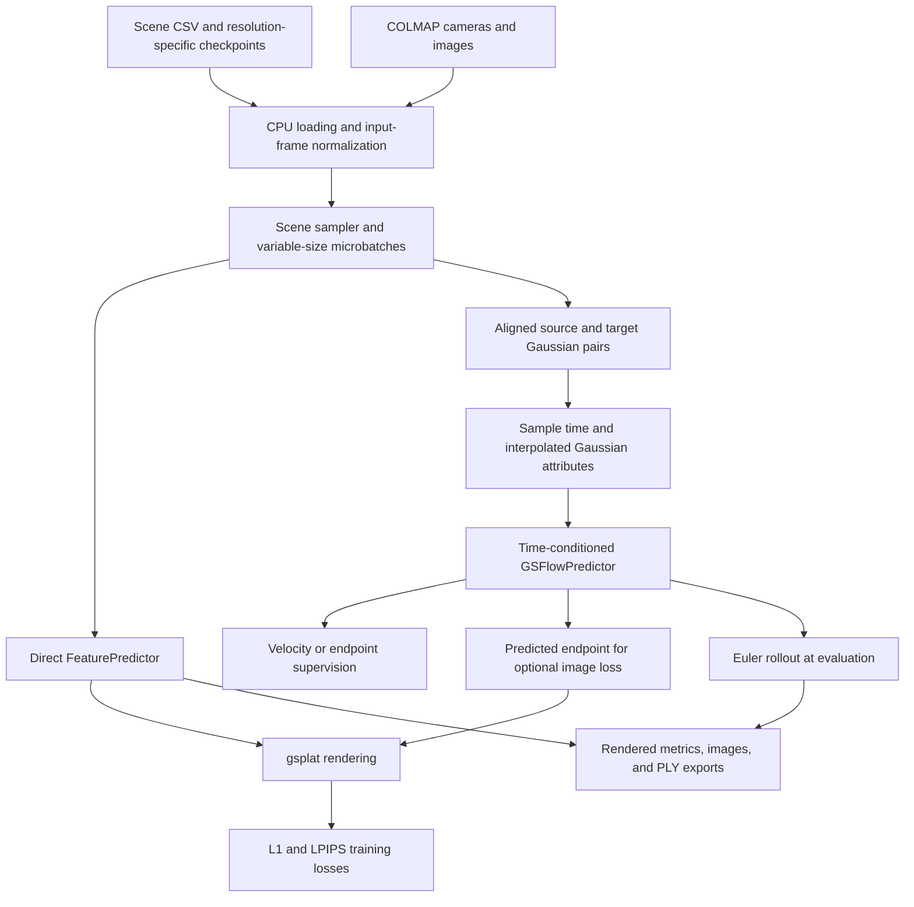

# SplatFormer: current repository state

Inspection date: **2026-09-18**. Snapshot commit: **`82dac3899c6e7dd233275376eaa1bb77adaba3ab`**, “Enhance training and evaluation processes with microbatching and test baseline reporting.” This document describes the files on disk, including the local test changes listed below. It is a source-code audit, not a claim that the training environment or experiments were reproduced.

The repository contains the original SplatFormer implementation for refining 3D Gaussian Splatting (3DGS) scenes for out-of-distribution novel-view synthesis, plus a newer super-resolution (SR) research pipeline. The newer pipeline supports direct image-supervised refinement, Gaussian-attribute supervision, and time-conditioned Gaussian flow matching (GSFM). The most developed current full-dataset paths are [train-sr.py](train-sr.py) and [train-sr-gsfm.py](train-sr-gsfm.py).

Several older entrypoints remain in the tree but import dataset modules that are absent. A script's presence is therefore not evidence that it runs in this checkout. Existing reports also describe older configurations; their model counts and results should not be assigned to the current configuration.

## Contents

1. [Repository map and workflow families](#1-repository-map-and-workflow-families)
2. [Representation, models, and rendering](#2-representation-models-and-rendering)
3. [Datasets and alignment](#3-datasets-and-alignment)
4. [Highlighted launchers and effective configuration](#4-highlighted-launchers-and-effective-configuration)
5. [Training mechanics and objectives](#5-training-mechanics-and-objectives)
6. [Evaluation, checkpoints, and inspection tools](#6-evaluation-checkpoints-and-inspection-tools)
7. [Dependencies and execution examples](#7-dependencies-and-execution-examples)
8. [Development state, tests, and limitations](#8-development-state-tests-and-limitations)

## 1. Repository map and workflow families

### Directory map

| Location | Role in this checkout |
| --- | --- |
| [README.md](README.md) | Original paper-oriented installation, OOD training, evaluation, and SIBR instructions; does not describe most current SR behavior. |
| Root `train*.py` and `overfit*.py` | Independent experiment entrypoints; they do not all share one training engine or dataset interface. |
| [configs/](configs/) | Gin bindings grouped into model, dataset, training, and overfitting configurations. |
| [scripts/](scripts/) | Bash experiment launchers, viewer entrypoints, and statistics/ablation utilities. |
| [dataset/](dataset/) | Legacy Gaussian loading, current SR loading, COLMAP/checkpoint I/O, normalization, and shared scene microbatch loading. |
| [models/](models/) | Direct attribute predictor, flow predictor, PTv3 wrappers, sparse-convolution utilities, and an architecture write-up. |
| [sr/](sr/) | Correspondence/alignment, external densification, matching utilities, flow objectives, and Euler sampling. |
| [utils/](utils/) | Gaussian rendering/export, losses, metrics/report caching, optimizers, device transfer, logging, transforms, and flow-viewer support. |
| [Pointcept/](Pointcept/) | Submodule providing Point Transformer components and native point operations. The flow wrapper can load its local time-conditioned model. |
| [DataGenerator/](DataGenerator/) | Submodule with Blender rendering, COLMAP preparation, Gaussian fitting, generation orchestration, and vendored rendering/training dependencies. |
| [emd_assignment/](emd_assignment/) | Local native extension used by EMD alignment. |
| [SIBR_viewers/](SIBR_viewers/) | Viewer submodule for exported Gaussian scenes. |
| [eval_viewer/](eval_viewer/) | FastAPI evaluation browser with a React/TypeScript/Vite frontend. |
| [tests/](tests/) | Focused Python regression tests, including local uncommitted additions. |
| [reports/](reports/) and [experiments/](experiments/) | Historical architecture/overfitting analysis and experiment launch scripts. |
| [outputs/](outputs/), [wandb/](wandb/), [test-set/](test-set/) | Locally present outputs, logging artifacts, and example/test data. Their presence does not establish completeness of the external SR dataset. |

[.gitmodules](.gitmodules) declares `Pointcept`, `DataGenerator`, and `SIBR_viewers`. The submodules are separate codebases; this audit concentrates on their integration points rather than reviewing every vendored implementation.

### Workflow comparison

| Workflow | Entrypoints | Model/data supervision | Current qualification |
| --- | --- | --- | --- |
| Original OOD refinement | [train.py](train.py), [overfit.py](overfit.py) | `FeaturePredictor`, legacy scene loading, rendered-image training/evaluation | Both import absent `dataset/Loader.py`; original overfit also references `dataset.GS_level`. Do not treat the original README commands as verified runnable commands. |
| Image-supervised SR | [train-sr.py](train-sr.py) | Source-resolution Gaussians → `FeaturePredictor` → target-resolution images; L1 plus LPIPS | Uses current `SplatFactoSRDataset`, shared CPU loading, microbatches, and DDP. Does not require target Gaussian attributes for the training loss. |
| Legacy SR overfit | [overfit-sr.py](overfit-sr.py) | Direct predictor with factor-based multilevel scene data | Imports absent `dataset/GS_multi.py`; factors 4→2 differ from current explicit resolution settings. |
| Gaussian-attribute SR | [train-sr-mse.py](train-sr-mse.py), [overfit-sr-mse.py](overfit-sr-mse.py) | Aligned source/target Gaussian attributes, `FeaturePredictor`, feature-specific losses | Separate older loops. Full-dataset MSE trainer accepts render-loss Gin keys for compatibility but optimizes Gaussian attributes only. |
| Full-dataset GSFM | [train-sr-gsfm.py](train-sr-gsfm.py) | Aligned Gaussian pairs, time-conditioned `GSFlowPredictor`, velocity or endpoint loss, optional image loss | Current distributed flow-training path. |
| Fixed-scene GSFM overfit | [overfit-sr-gsfm.py](overfit-sr-gsfm.py) | One or a fixed subset of test scenes, same flow model family | Single-process diagnostic/memorization workflow; its variance sources and launch defaults differ from full training. |

Overfitting the selected test scenes measures the ability to memorize those mappings. It is not held-out generalization evidence.

## 2. Representation, models, and rendering

### Gaussian attributes

[dataset/gs_io.py](dataset/gs_io.py), especially `GSPLAT_KEY_MAP` and `load_gsplat`, translates checkpoint attributes into the repository's runtime dictionary:

| Runtime key | Shape | Meaning |
| --- | --- | --- |
| `means` | `[N, 3]` | Gaussian centers in the normalized scene frame. |
| `scales` | `[N, 3]` | Log axis scales. Rendering exponentiates them. |
| `opacities` | `[N, 1]` | Opacity logits. Rendering applies sigmoid. |
| `quats` | `[N, 4]` | Rotation quaternions. Passed to the renderer; quaternion updates depend on model configuration. |
| `features_dc` | `[N, 3]` | SH degree-zero coefficients, loaded from `sh0` with its singleton coefficient dimension removed. |
| `features_rest` | `[N, K, 3]` | Remaining SH coefficients, loaded from `shN`; flattened for model input. |

Both supplied model Gin files use SH degree 1: `K=3`, so all six attributes together provide **23 scalar input channels per Gaussian**. Checkpoint SH dimensionality must agree with the predictor configuration; changing the image resolution does not change SH degree.

### Main data flow



### Direct refinement model

[models/feature_predictor.py](models/feature_predictor.py), `FeaturePredictor.forward`, concatenates variable-size scenes into one point batch with cumulative offsets, computes PTv3 features, applies a separate MLP head for each output attribute, and splits the result back into scenes. In the supplied [ptv3.gin](configs/model/ptv3.gin), outputs are residuals added to the input attributes. Attributes not predicted can be preserved from the input.

The configuration uses a PT backbone, grid resolution 384, backbone output width 96, four-layer attribute heads of width 256, raw input features concatenated into the heads, and zero-initialized final head layers. Position residuals pass through `tanh`; other attribute residuals use identity activation. Quaternion residual mode defaults to `add`; `mul` uses normalized quaternion composition. BatchNorm is disabled, drop path is 0, and serialization order shuffling is enabled for training but disabled for evaluation.

The current predictor no longer asserts that its output batch has exactly one scene. It preserves each scene's Gaussian count: higher-resolution rendering does not itself create additional Gaussian slots.

### Flow model

[models/feature_flow_predictor.py](models/feature_flow_predictor.py), `GSFlowPredictor`, predicts updates/velocities rather than a complete refined scene. It receives the current Gaussian attributes, one time value per scene, and reference positions. The time embedding is exactly `[t, sin(t), cos(t)]`. The supplied `T_dim=3` matches this embedding; changing `T_dim` alone does not change the predictor's embedding implementation.

The full trainer and Euler sampler pass **source Gaussian positions** as `batch_reference_means`. These positions determine voxel coordinates, serialization, and sparse spatial support while evolving positions remain part of the feature vector. This is source-conditioned refinement, not an image/text-conditioned generator.

[models/pointtransformer_v3_flow.py](models/pointtransformer_v3_flow.py) resolves the time-conditioned Pointcept model through the registry/import path, with a fallback to the local submodule's `point_transformer_v3m1_time.py`. The wrappers use an encoder/decoder hierarchy with serialized attention, pooling/unpooling, and sparse-convolution components.

Current [ptv3_flow.gin](configs/model/ptv3_flow.gin) settings are:

| Setting | Current value |
| --- | --- |
| Encoder channels | `(96, 144, 192, 384, 768)` |
| Decoder channels | `(128, 192, 384, 384)` |
| Encoder / decoder depths | `(2, 2, 2, 6, 2)` / `(2, 2, 2, 2)` |
| Encoder / decoder heads | `(2, 4, 8, 16, 32)` / `(4, 4, 8, 16)` |
| Stride | `(1, 2, 2, 2)` |
| `enc_dim` / output width | 64 / 128 |
| Attribute heads | Four layers, width 128, zero-initialized final layers |
| Grid resolution | 1024 |
| Flash attention | Enabled |
| `turn_off_bn` | `False` in model Gin; overridden to `True` by the overfit launcher |
| Drop path | Python default 0.3; model Gin does not override it; overfit launcher sets 0.0 |

The output still has the same number of Gaussian slots as its input. External alignment/densification can choose a larger input set; the network itself does not learn point creation. `sample_flow_model` starts from the supplied source and adds no random inference noise. Training interpolant noise is a separate setting.

### Rendering

[utils/gs_utils.py](utils/gs_utils.py), `_prepare_render_inputs`, `_rasterize_gaussians`, and `rasterize_gaussians_to_multiimgs`, convert stored attributes to gsplat inputs, construct intrinsics/view matrices, and render images. Log scales are exponentiated and opacity logits are sigmoided. When higher-order SH coefficients exist, color is supplied as SH coefficients; otherwise the DC field is passed through sigmoid as direct color. This distinction matters when interpreting attribute-space errors.

## 3. Datasets and alignment

### Current SR directory contract

[SplatFactoSRDataset](dataset/GS_SR.py) uses explicit source and target resolution integers. [resolution_paths and fitted_paths](dataset/gs_io.py) construct the following paths:

```text
DATASET_ROOT/
  psnr_filtered_scenes.csv
  test_psnr_filtered_scenes.csv
  gs_statistics.json                         # full-training velocity statistics
  test_gs_statistics.json                    # optional overfit statistics source
  train-set/objaverse/<resolution>/
    colmap/<scene_id>/images/...
    colmap/<scene_id>/sparse/0/cameras.{txt,bin}
    colmap/<scene_id>/sparse/0/images.{txt,bin}
    gsplat/<scene_id>/ckpts/ckpt_<step>_rank0.pt
  test-set/objaverse/<resolution>/...
  train-set-4x-up/objaverse/<fit_source_resolution>/gsplat/<scene_id>/ckpts/...
  test-set-4x-up/objaverse/<fit_source_resolution>/gsplat/<scene_id>/ckpts/...
```

The native split paths are derived from `dataset_root`, split, dataset name, and resolution. Fitted roots are separate Gin settings; the `4x-up` directory name is a configured convention, not a dynamically computed resolution ratio.

Scene manifests must be nonempty CSVs with a `scene_id` column. The checkpoint loader chooses the largest numeric step matching `ckpt_*_rank0.pt`, loads its `splats` mapping, and requires all six attributes. It validates consistent leading Gaussian counts. COLMAP camera/image models may be text or binary; the loader expects one camera entry per scene.

Size-aware sampling additionally requires positive integer `res_<resolution>_num_gs` values for every selected scene. Direct SR uses source-resolution counts. GSFM uses source counts for `fit_lr_to_hr` and target counts for its other alignment modes. Counts are capped by `max_gs_num` before classification; they are metadata estimates rather than counts obtained by loading every checkpoint.

### Normalization and payloads

[GaussianProcessor](dataset/gs_processing.py) removes nonfinite Gaussians, optionally removes spatial outliers, and caps the set by retaining the first selected rows. An empty result is an error. Defaults in [objaverse-sr.gin](configs/dataset/objaverse-sr.gin) disable outlier removal, cap native sets at 100,000 Gaussians, use black backgrounds, and select eight training views per scene.

The source-resolution Gaussians define one `MinMaxScaler` coordinate frame. Target Gaussians and camera translations are transformed into that frame, and log scales are adjusted by the log coordinate scale. Payload metadata includes `coordinate_frame="input_resolution"`, version 1, and the source resolution. Each sample contains scene identity and a `data` mapping keyed by resolution, with Gaussian and/or image/camera payloads depending on load flags.

The original source checkpoint is loaded to derive the coordinate frame even if the source Gaussian payload is disabled. Fitted pairs are validated against the original source of the fit: keys and shapes must match, the same source selection mask is applied, and retained fitted values must be finite. Missing fitted checkpoints fail explicitly.

Full image-supervised SR training loads source Gaussians and target images, without target Gaussians or source images. GSFM training always loads both Gaussian sets and enables target images only for schedules with render loss. Evaluation needs additional images/Gaussians for baselines even when training is `fm-only`.

### Four GSFM alignment modes

The current full trainer's `build_gaussian_pair` uses preloaded fitted pairs directly. [sr/alignment.py](sr/alignment.py), [sr/densification.py](sr/densification.py), and [sr/matching.py](sr/matching.py) provide shared alignment and historical matching/artifact utilities.

| Mode | Source → supervised target | Count and prerequisites |
| --- | --- | --- |
| `fit_lr_to_hr` | Original LR Gaussians → precomputed HR-image-fitted Gaussians on LR slots | Preserves selected LR count. Fitted root indexed by LR resolution. This is the launcher default. |
| `fit_hr_to_lr` | HR slots fitted to LR images → original HR Gaussians | Uses selected HR count. Fitted root indexed by HR resolution. |
| `emd` | Interpolated/densified LR set reordered by EMD → original HR set | Uses target correspondence/count; requires the local EMD extension and appropriate equal-count alignment inputs. |
| `random` | Interpolated LR set, randomly permuted → original HR set | Uses target-sized selection without EMD correspondence. |

Midpoint densification uses CUDA `pointops` neighbors, creates additional candidate slots, and uses farthest-point sampling when there are too many candidates. It interpolates color attributes and initializes other new attributes with explicit heuristics. It is preprocessing, not a trainable network stage. `attribute_init=aligned` keeps the constructed attributes; `3dgs` resets scales from neighbor spacing, rotations to identity, and opacity to 0.1. That option is relevant to `emd`/`random`, not a switch for replacing the precomputed fitted-pair contract.

Modes that require HR count, geometry, or fitted HR slots are training/evaluation constructions. Their availability should not be assumed for deployment with only a new LR scene.

## 4. Highlighted launchers and effective configuration

### How settings combine

Entrypoints parse repeated `--gin_file` options and then `--gin_param` bindings through Gin. Loaded files provide defaults; explicit bindings and direct Python arguments passed to constructors can override them. Scoped bindings such as `train_dataset/SplatFactoSRDataset.image_per_scene` differ from class-wide bindings. `config.gin` records operative Gin configuration, not every CLI/environment value; retain the launch command and logs as well.

The following tables describe the launchers **without user overrides**. Positional arguments take precedence over environment fallbacks where the script explicitly implements those fallbacks. Not every positional setting has an environment counterpart.

### `scripts/train-sr-on-objaverse.sh`

[Launcher](scripts/train-sr-on-objaverse.sh) → `torchrun train-sr.py`, loading `ptv3.gin`, `objaverse-sr.gin`, and `train/sr.gin` in that order.

| Position | Meaning | Launcher default |
| --- | --- | --- |
| 1 | Total optimizer-loop steps | 100,000 |
| 2 | Save interval | 1,000 |
| 3 | Evaluation interval | 1,000 |
| 4 | Training image logging interval | 1,000 |
| 5 | Input resolution | `$INPUT_RESOLUTION`, otherwise 32 |
| 6 | Target resolution | `$TARGET_RESOLUTION`, otherwise 128 |

Environment controls include `NGPUS=1`, optional `GPU_IDS`, `MASTER_PORT=29518`, `NUM_WORKERS=2`, `PREFETCH_FACTOR=2`, `PIN_MEMORY=true`, `BATCH_SIZE=4`, `GRAD_ACCUM_STEPS=1`, `SCENE_SAMPLING=big_small`, and `BIG_SCENE_THRESHOLD=25000`. Without `GPU_IDS`, this launcher does not set `CUDA_VISIBLE_DEVICES` itself.

The default data root is `/project/ricky/splatformer-sr-data-scaled`; training/test CSV paths derive from it and can be overridden with `TRAIN_SCENE_LIST` and `TEST_SCENE_LIST`. `OUTPUT_DIR` defaults to `/project2/ricky/outputs/<MMDD>-gpu7/objaverse_splatformer_sr_<input>to<target>`. The `gpu7` suffix is just a directory label, not GPU selection.

The launcher sets both the trainer resolution flags and dataset resolution bindings, overrides the `total_steps` macro so the scheduler tracks the requested duration, and sets eight training views. The underlying training Gin instead starts with 200,000 steps and 2,000-step save/evaluation/image intervals. It uses Adam, a constant LR schedule, AMP, clipping at norm 2, and L1/LPIPS weights of 1 each. Backbone/most head LRs are `3e-5`; SH-rest uses `1.5e-6`.

### `scripts/overfit-sr-on-objaverse.sh`

[Launcher](scripts/overfit-sr-on-objaverse.sh) → `python overfit-sr.py`, loading `ptv3.gin` and `overfit/sr.gin`.

This is a legacy, machine-specific launcher. It queries `nvidia-smi` for an idle GPU and exits if none is found, then **overwrites the selected GPU with `GPU_ID=5`**. The scene is fixed to `3e288ee8aced4a0797e66d53536112b1`. The first four positions are total steps, save interval, evaluation interval, and image interval, with defaults `1000, 200, 200, 200`.

Input paths point to `/project/ricky/splatformer-data/test-set-512/objaverse/{nerfstudio,colmap}`. Outputs go under `/project/ricky/outputs/objaverse_splatformer_overfit_sr_512_gsplat/<scene>`. The script uses `SplatFactoMultiLevelDataset`, factor constants 4→2, and factor bindings `[2, 4]`; it does not accept the current resolution/manifest contract.

**Current blocker:** `overfit-sr.py` imports `dataset.GS_multi`, which is absent from this checkout. Its intended image-loss loop and exports can be read, but this launcher is not a working substitute for the current SR overfit workflow without restoring/adapting that dependency. Also, it overrides `training.total_steps` without updating the `total_steps` macro used by scheduler bindings; its constant schedule reduces the immediate effect of this mismatch.

### GSFM full training versus overfitting

[Full-training launcher](scripts/train-sr-gsfm-on-objaverse.sh) → [train-sr-gsfm.py](train-sr-gsfm.py), using model, dataset, and `train/sr_gsfm.gin` files. [Overfit launcher](scripts/overfit-sr-gsfm-on-objaverse.sh) → [overfit-sr-gsfm.py](overfit-sr-gsfm.py), substituting `overfit/sr_gsfm.gin`.

Both expose these 14 positional arguments:

| Position / setting | Full-training default | Overfit default |
| --- | --- | --- |
| 1: total steps | 500,000 | 20,000 |
| 2: save interval | 1,000 | 20,000 |
| 3: evaluation interval | 1,000 | 4,000 |
| 4: image logging interval | 1,000 | 4,000 |
| 5: alignment | `fit_lr_to_hr` | `fit_lr_to_hr` |
| 6: attribute initialization | `aligned` | `aligned` |
| 7: source resolution | 32 | 128 |
| 8: target resolution | 128 | 512 |
| 9: loss-mixing schedule | `linear` | `fm-only` |
| 10: flow loss | `velocity` | `velocity` |
| 11: configured flow steps | 10 | 1 |
| 12: interpolant noise standard deviation | 0.0 | 0.0 |
| 13: image L1 weight | 1.0 | 1.0 |
| 14: LPIPS weight | 1.0 | 1.0 |

The full-training launcher falls back to named environment values for positions 5–14. The overfit launcher uses literal defaults for positions 5–8 and environment fallbacks for 9–14. Its GPU, scene selection, batching, and paths are environment-configurable separately.

Important configuration-layer differences:

| Setting | Python / Gin baseline | Launcher effect |
| --- | --- | --- |
| Alignment | Python flag: `emd` | Both launchers select `fit_lr_to_hr`. |
| Resolutions | Dataset Gin: 128→512 | Full launch: 32→128; overfit: 128→512. |
| Training duration | Full Gin: 600,000; overfit Gin: 200,000 | Launchers override duration and scheduler total steps together. |
| Loss mix | Python: `linear`; full Gin: `fm-only`; overfit Gin: `free-range-gs` | Full launch: `linear`; overfit launch: `fm-only`. |
| Configured rollout steps | Python/Gin: 5 | Full launch: 10; overfit launch: 1. Main evaluation uses the separate constant `[10]`. |
| Grid | Model Gin: 1024 | Full launch explicitly sets 1024; overfit defaults to 2048. |
| BatchNorm/drop path | Full model: BN enabled, drop path 0.3 | Overfit overrides BN off and drop path 0.0. |

Full training uses `GPU_ID=8` as the fallback for `GPU_IDS`, `NGPUS=1`, rendezvous port 29519, one worker with prefetch factor 1, pinned memory, batch size 6, one accumulation step, and `big_small` sampling at threshold 25,000. `ZERO_OPTIMIZER=false` is an opt-in toggle for distributed optimizer-state sharding. Set visible GPU IDs explicitly on other machines.

Full-training `DATASET_ROOT`, CSVs, and `GS_STATISTICS_PATH` default to the scaled dataset root and its `gs_statistics.json`. Its default output is `/project2/ricky/outputs/<MMDD>-gpu7/objaverse_sr_gsfm_<input>to<target>_<alignment>_<schedule>_reg`. Fitted roots remain independently configured in dataset Gin: overriding `DATASET_ROOT` alone does **not** retarget them.

Overfit uses `GPU_ID=5`, `SCENE_MODE=one`, `SCENE_COUNT=1`, the same fixed scene ID as the older overfit script, `BATCH_SIZE=1`, and `GRAD_ACCUM_STEPS=1`. `SCENE_MODE=many` selects a seeded fixed set of unique scene names from the **test** dataset. Both fitted roots default to `${DATASET_ROOT}/test-set-4x-up/objaverse` and are overridable with `FIT_LR_TO_HR_ROOT` and `FIT_HR_TO_LR_ROOT`. Outputs default beneath `/project2/ricky/experiments/<MMDD>/overfit_sr_gsfm_512/`, with a run name encoding scene selection, alignment, initialization, resolutions, mix, noise, grid, batch, and postfix. `OUTPUT_DIR` takes precedence over the generated path. The postfix environment variable is spelled **`CUSTOM_POSFIX`** in the script.

Overfit also exposes `VELOCITY_VARIANCE_SOURCE=matching`, `GS_STATISTICS_PATH` ending in `test_gs_statistics.json`, `FLOW_T_EPS=1e-4`, `PTV3_DROP_PATH=0.0`, `PTV3_SHUFFLE_ORDERS=True`, `PTV3_SHUFFLE_ORDERS_EVAL=False`, `PTV3_TURN_OFF_BN=True`, and `GRID_RESOLUTION=2048`.

Optional architecture overrides are forwarded as Gin parameters when nonempty. The `PTV3_` prefix covers embedding/output widths, encoder/decoder channels, depths, heads, stride, embedding type, `T_dim`, Flash attention, PDNorm options, and pretrained checkpoint. The `GS_` prefix covers head depth/width/type, input-feature concatenation, zero initialization, residual activations, and quaternion update mode. Values such as tuples and booleans must be valid Gin literals. Head type currently supports `mlp-relu`; arbitrary `T_dim` values are not automatically compatible with the fixed three-component embedding.

## 5. Training mechanics and objectives

### Full-dataset GSFM control flow

The main stages in [train-sr-gsfm.py](train-sr-gsfm.py) are:

1. `main` parses Gin; `training` selects the local CUDA device and initializes NCCL when `WORLD_SIZE>1`.
2. Build training, test, and training-evaluation datasets with explicit payload requirements. Persist a fixed training-evaluation subset.
3. Construct `GSFlowPredictor`; optionally load model weights; convert SyncBatchNorm and wrap DDP for distributed runs.
4. Build optimizer/scheduler, load aggregate velocity variances when required, and construct the shared scene loader.
5. `prepare_microbatch` transfers selected tensors and constructs paired Gaussian samples. `prepare_scene_sample` samples time and interpolant noise, plus image views for render-loss schedules.
6. `compute_microbatch_loss` performs one model forward over the variable-size scene list, then sums per-scene losses. Backward accumulation is followed by clipping and one optimizer step.
7. Log scalar/image diagnostics, evaluate held-out and fixed training scenes, and periodically save weights. `main` tears down the distributed process group and finishes W&B in `finally`.

### Batch semantics and scene loading

[dataset/scene_loader.py](dataset/scene_loader.py) provides `SRSceneDataset`, `SceneMicrobatchSampler`, `build_train_loader`, and the `training_microbatches` cleanup context. The map-style adapter calls `load_scene` directly, avoiding a second round of the iterable dataset's own sharding. Variable-size scenes remain a Python list at collation rather than being stacked.

For the current full SR/GSFM trainers:

```text
batch_size = scene samples per GPU per optimizer update
global scene batch = batch_size * world_size
grad_accum_steps = number of pieces into which each per-GPU batch is split
```

For example, batch 7 with three accumulation steps produces microbatches `[3, 2, 2]`. Each microbatch loss is a **sum** divided by 7, then accumulated. Gradient accumulation does not multiply the effective batch. Flags enforce `1 <= grad_accum_steps <= batch_size`. DDP synchronization is suppressed until the last microbatch with `no_sync`.

Sampling modes are:

| Mode | Behavior |
| --- | --- |
| `random` | Uses all eligible scenes without Gaussian-count metadata. |
| `big_small` | Allows at most one big scene in a multi-scene microbatch, places it last, and fills the remainder with small scenes. Singleton batches can contain either size. |
| `avoid_big` | Removes big scenes before rank partitioning and padding. Fails if no scenes remain. |

“Big” means capped CSV count **strictly greater than** the threshold. `big_small` does not guarantee every batch can be filled: insufficient small scenes raise an error, for which singleton microbatches are an explicit supported alternative. Size-based sampling is not a guarantee against GPU memory exhaustion.

The sampler cycles indefinitely through epochs, pads rank assignments when needed, and can cross epoch boundaries within a microbatch. Spawned workers restore Gin bindings and seed NumPy/Python RNGs. Positive worker counts enable persistent workers; `num_workers=0` loads synchronously. Prefetch factor counts microbatches per worker, per GPU. The cleanup context shuts down workers, including on failures. `move_training_data` in [utils/gpu_utils.py](utils/gpu_utils.py) recursively transfers tensor containers, optionally nonblocking.

### Image-supervised SR loss

`train-sr.py::compute_microbatch_loss` feeds source Gaussians directly to `FeaturePredictor`, renders the result from target cameras, and averages per-view image losses within each scene. The objective is weighted L1 plus optional LPIPS. There is no alignment/densification requirement for this direct image-supervised path, and no Gaussian-attribute target is needed for its training loss.

### Flow objective and sampling

[sr/flow.py](sr/flow.py) operates on all six attributes. Let `x0` be the aligned source and `x1` the target. Training samples `t` between `flow_t_eps` and `1-flow_t_eps` and forms:

```text
x(t) = (1-t) * x0 + t * x1 + gamma(t) * epsilon
gamma(t) = flow_noise_std * sqrt(max(2*t*(1-t), 1e-6))
target velocity = x1 - x0 + gamma_dot(t) * epsilon
```

At the default zero noise scale, this is straight interpolation between corresponding Gaussian attributes. Time is sampled per scene, not incremented according to optimizer step.

`loss_type=velocity` computes per-attribute mean squared velocity error divided by a per-channel variance and sums the attributes with unit weights. Full training reads standard deviations from `statistics["aggregate"]["delta"]`, squares them, and floors variances at `1e-8`. Statistics keys use `means`, `sh0`, `shN`, `opacities`, `scales`, and `quats`. These must correspond to compatible data processing, shapes, and alignment; the path name alone does not establish that compatibility.

`loss_type=x1` supervises an endpoint reconstructed from predicted velocity. The full trainer calls `predict_x1_from_velocity` with its default `source_anchored=True`: the base is the source, and the noise-corrected update is applied at full scale. It is not simply `x(t) + (1-t)*v`. The supplied feature weights are means 100, quaternions 10, and the other attributes 1; quaternion loss uses the feature-specific rotation treatment unless direct quaternion MSE is requested.

Render-loss schedules render this predicted endpoint, not a full multi-step Euler trajectory on every optimizer update. The mixing weights returned by `loss_mix_weights` are:

| Schedule | Flow weight | Render weight |
| --- | --- | --- |
| `linear` | `1-t` | `t` |
| `free-range-gs` | 1 | `50 * min(t/0.9, 1)^5` |
| `fm-only` | 1 | 0; render-loss image loading/computation is skipped in full training |

Thus a “linear schedule” here depends on sampled flow time, not training progress. Nonzero L1/LPIPS weights do not enable render loss when the selected schedule is `fm-only`.

Overfit supports `matching`, `precomputed_scene`, and `precomputed_aggregate` velocity variance sources. Its default computes population variance across the selected scene's matched Gaussian deltas. It writes `velocity_variance_statistics.json` and attempts to report all sources; unavailable precomputed sources are reported, and a selected unavailable source fails when needed for velocity loss. Full training has no equivalent `velocity_variance_source` option: it uses the aggregate statistics file.

`sample_flow_model` integrates from a clone of the source with explicit Euler steps at `t=step/flow_steps`, applying updates of size `1/flow_steps`. Quaternion `mul` mode uses model-specific composition instead of ordinary addition. Source spatial reference positions stay fixed throughout the rollout.

### Optimizer, precision, and recovery

[utils/optimizers.py](utils/optimizers.py), `build_optimizer`, creates parameter groups for the backbone and each attribute head. Both full trainers use Adam with `eps=1e-15` under the supplied configurations. Image SR uses constant LR; GSFM uses linear decay. GSFM full-training LRs are mostly `3e-5` with SH-rest `1.5e-6`; its overfit Gin uses mostly `3e-4`, scales `3e-3`, and SH-rest `1.5e-6`.

`use_zero=True` selects `ZeroRedundancyOptimizer` only with an initialized multi-rank process group. Single-rank execution uses the ordinary optimizer. This shards optimizer state, not the model itself, and is not automatic activation/memory sharding. The GSFM full launcher exposes it as `ZERO_OPTIMIZER`.

Both full trainers use AMP gradient scaling and norm clipping. They advance the LR scheduler only when the scaler indicates an optimizer update was not skipped. In GSFM's shared loss function, autocast is enabled only during model training; evaluation losses are full precision because sparse-convolution inference has a different casting path. Do not infer uniform AMP behavior across all legacy entrypoints.

## 6. Evaluation, checkpoints, and inspection tools

### Checkpoint and resume semantics

The current full trainers save `model.state_dict()` to `checkpoints/model_<zero-based-step>.pth` and `checkpoints/model_last.pth`. Periodic saves trigger on `(step+1) % save_interval == 0`; for interval 1000, the first filename is `model_00000999.pth`. Periodic evaluation checks `step % eval_interval == 0`, so the first evaluation labeled step 0 follows the first training update.

These are **model-weight checkpoints**, not complete restart snapshots: optimizer, scheduler, scaler, RNG, and data-loader state are not saved together. `resume_from_step` changes the loop start but does not restore those states. Load weights through `FeaturePredictor.resume_ckpt` or `GSFlowPredictor.resume_ckpt`, with matching architecture bindings.

`--only_eval` skips the training loop but still constructs configuration, datasets, model, and optimizer-related objects. It does not select a checkpoint automatically. GSFM additionally needs its loss/statistics and training-subset inputs for the evaluation losses. GSFM writes `model_last.pth` after evaluation-only execution too; use a separate output directory to keep evaluation artifacts distinct from an existing run.

### Metrics and fixed baselines

[utils/metrics.py](utils/metrics.py) implements PSNR, SSIM, and VGG LPIPS. `MetricComputer` instantiates LPIPS on CUDA, so the actual rendering/metric path is not CPU-only. The new `scene_metric_report` reads all accumulated metric tensors, including all LPIPS subbatches, and writes named per-view records. Dataset reports average **scene means**, giving equal weight to scenes rather than pooling every image globally.

`TestBaselineReports` caches invariant test renders under `eval_baselines/test/`:

| Trainer | Baseline sources |
| --- | --- |
| Image SR | `input`, `target_high_res`; legacy aliases `gt_low_res` and `gt_high_res` are also written in the baseline folder. The low-resolution GT alias refers to the input Gaussian set. |
| GSFM | `input`, `target_fit_lr_to_hr`, `target_high_res`. |

These are Gaussian render baselines against target images. A fitted target is distinct from the original HR Gaussian set. GSFM test-baseline creation requires the LR-to-HR fitted target even when the training alignment is another mode; missing fitted data is not silently substituted.

The cache signature includes dataset/configuration settings, selected scenes, and artifact path/size/modification-time information. A reusable cache also requires complete, internally consistent reports and view records. This is metadata-based invalidation, not a content hash of every input. Prediction reports link to fixed baselines instead of duplicating their full results at every step.

### Full-training output organization

Common run-root artifacts are `config.gin`, `train.log`, `checkpoints/`, `eval/<eight-digit-step>/`, `eval_final/` (configurable through `eval_subdir`), and `eval_baselines/test/`. W&B is enabled by default in both full trainers with project `3dgs-super-resolution`; direct invocation supports `--use_wandb=false`.

| Artifact | Interpretation |
| --- | --- |
| `eval_baselines/test/manifest.json` | Signature, completeness, views, and cache bookkeeping. |
| `eval_baselines/test/metrics_<source>.json` | Aggregate fixed-baseline reports. |
| `eval_baselines/test/scenes/<scene>/metrics_<source>.json` | Named per-view baseline measurements. |
| Image SR `eval/<step>/metrics.json` | Prediction dataset report with means, scene counts, exclusions, scene-report links, and baseline links. |
| Image SR `eval/<step>/<scene>/metrics.json` | Prediction per-view report. `scene_average_metrics.json` supplies scene summaries at iteration level. |
| GSFM `eval/<step>/metrics.json` | Flow-step report index with baseline links. |
| GSFM `eval/<step>/flow_steps_10/metrics.json` | Prediction dataset report for ten Euler steps. |
| GSFM `eval/<step>/flow_steps_10/<scene>/metrics.json` | Per-view report for a scene. |
| GSFM `eval/<step>/losses.json` | Recomputed evaluation objectives, with means and scene records. |
| GSFM `train_eval_scenes.json` | Persistent names for up to five fixed training-evaluation scenes. |
| GSFM `eval/<step>/train/` | Metrics and losses on that fixed training subset. Its legacy metric shape differs from the test report index. |

The same evaluation layouts are used beneath `eval_final`. Image SR writes training preview grids under `train/`. Scene evaluations write prediction images, optional comparison images, and optional viewer exports; the precise nesting is defined by each `evaluate_single_scene`. In GSFM, prediction images are under a scene evaluation directory's `pred/<scene>/`, optional comparisons under `compare/<scene>/`, and PLYs under `viewer/<scene>/point_cloud/` as `input.ply`, `output.ply`, and optionally `gt.ply`. `save_residuals` is accepted by the full GSFM trainer for compatibility but does not implement the direct SR residual-export behavior.

Both GSFM entrypoints define **`EVAL_FLOW_STEPS = [10]`**. Changing `flow_matching.flow_steps` alone does not change the main evaluation sweep; some training-image/preview calls do use the configured value.

Full GSFM evaluation persists up to five unique training scene names, validates them on reuse, and samples per-scene evaluation randomness using `eval_seed` and stable scene/split identity. Evaluation restores model mode and RNG state. It bypasses DDP forwards for uneven evaluation shards, broadcasts buffers, and gathers summaries across ranks. Direct SR records scene evaluation exceptions as exclusions and continues; inspect counts and exclusion records before comparing its means. GSFM does not have the same blanket skip-on-scene-error policy.

### Overfit outputs and interpretation

The GSFM overfit path records `selected_scenes.json`, `overfit.log`, operative `config.gin`, `baseline_render_metrics.json`, per-scene variance diagnostics, checkpoints, and flow-step evaluations. This preserves the chosen scene set and matched-target reference renders for memorization experiments. It uses its own reporting layout; the full-training baseline cache contract should not be assumed for these older outputs.

### Visualization tools

- [scripts/visualize_gs_flow.py](scripts/visualize_gs_flow.py), backed by [utils/flow_viewer.py](utils/flow_viewer.py), loads an operative configuration, checkpoint, and scene, samples a trajectory, and provides a Viser interface for Gaussian/point-cloud views, updates, voxel occupancy, and Point Transformer structure inspection. Required flags are `--config`, `--checkpoint`, and `--scene_name`; defaults include ten flow steps, device `cuda`, and port 8082. A `--dry_run` option exists but still requires model/data dependencies.
- [scripts/visualize_gs_displacement.py](scripts/visualize_gs_displacement.py) provides a separate displacement inspection tool.
- [scripts/run_eval_viewer.py](scripts/run_eval_viewer.py) launches the read-only FastAPI/React evaluation explorer. It accepts `--eval-dir`, `--reference-iteration` (default `00000000`), `--host`, and `--port`. Its index reads numeric iteration folders and legacy metric/comparison-strip layouts.
- [SIBR_viewers/](SIBR_viewers/) consumes compatible PLY exports. Follow the chosen export layout rather than assuming every trainer writes the original README's `iteration_0`/`iteration_1` naming.

The [evaluation viewer README](eval_viewer/README.md) still names absent `train-sr-2stage.py` and a Python test glob without matching files in the current root test set. Its index does not implement the new baseline-link or GSFM flow-step report traversal. Compatibility with the new full-training outputs is therefore not established; copying its historical example is not a validation of current report support.

### Existing research reports

[The September 11 capacity audit](reports/ptv3_capacity_2026-09-11/architecture_and_parameters.md) and [generation assessment](reports/ptv3_capacity_2026-09-11/generation_assessment.md) analyze an earlier model configuration, including a reported 47.96M-parameter model. They distinguish fixed-slot refinement from learned point creation and diverse generation. Current channel widths differ, so this document does not reuse that parameter count as a current count.

[The 19-scene overfit diagnosis](reports/ptv3_19_scene_overfit/diagnosis.md) reports historical batch-1 versus batch-4 final scene-mean PSNR of 24.98 versus 28.54 dB, with matched targets at 32.71 dB. It identifies sensitivity to sample exposure/optimization and a substantial SH-rest residual, rather than proving insufficient model capacity. These are findings reported from older saved experiments, not measurements rerun for this document or expected results for today's defaults.

## 7. Dependencies and execution examples

### Repository-declared environment

The [root README](README.md) describes Ubuntu 22.04, CUDA 11.8, GCC 8.5, Python 3.8, PyTorch 2.1.2, torchvision 0.16.2, torchaudio 2.1.2, local Pointcept installation, Flash attention, and `gsplat==1.5.3`. These are the repository's historical installation instructions, not a newly validated environment specification.

[requirements.txt](requirements.txt) instead points PyG wheels at **Torch 2.7.1 / CUDA 12.8**, while also listing **`spconv-cu118`**. Most packages are unpinned, and the file is not a complete lockfile: for example, entrypoints import `absl` while it is not explicitly listed there. A compatible Torch/CUDA/native-extension set must be established before claiming reproducibility; installing the README and requirements literally is not verified here.

Dependencies used by the current paths include Gin, PyTorch, Pointcept/pointops, spconv, Flash attention where enabled, gsplat, NumPy, OpenCV/Pillow, LPIPS, and W&B. EMD alignment adds the local [emd_assignment/setup.py](emd_assignment/setup.py) extension. Full trainers select CUDA devices and NCCL for multi-GPU execution; CPU unit tests with mocked models are not evidence of a working native GPU environment.

[DataGenerator/README.md](DataGenerator/README.md) and [DataGenerator/TRAINER.md](DataGenerator/TRAINER.md) describe Blender rendering and per-scene Gaussian fitting. The modern `DataGenerator/trainer.py` creates/fits scene parameters, refines their population, and exports gsplat checkpoints consumed by SR loading. Its checkpoint-based evaluation and per-scene optimizer system are separate from SplatFormer's neural refinement training. The root README explicitly requires a **separate `gsplat==0.1.11` environment for the vendored legacy nerfstudio code**, versus gsplat 1.5.3 for the modern renderer.

The evaluation browser has separate [Python requirements](eval_viewer/requirements.txt) and a [frontend package manifest](eval_viewer/web/package.json), using FastAPI plus React/Vite/TypeScript. Its README requests Node.js 20 or newer and an explicit frontend build.

### Commands to adapt to your environment

These examples were checked against source arguments; they were **not launched**. Run from the repository root in a configured GPU environment. Replace every `/path/to/...` value with existing data or an intended output location. Keep output directories separate across runs. Use Bash for the launchers, which contain Bash-specific syntax.

Image-supervised SR with explicit paths and two microbatches:

```bash
GPU_IDS=0 NGPUS=1 BATCH_SIZE=4 GRAD_ACCUM_STEPS=2 \
DATASET_ROOT=/path/to/splatformer-sr-data-scaled \
OUTPUT_DIR=/path/to/outputs/sr_32to128 \
bash scripts/train-sr-on-objaverse.sh 100000 1000 1000 1000 32 128
```

This uses `big_small` sampling, so the CSV needs `res_32_num_gs`. Add `SCENE_SAMPLING=random` to use a manifest without count columns. Even though the training loss only loads source Gaussians/target images, scheduled evaluation needs native target Gaussian checkpoints.

Full GSFM training with explicit fitted roots requires direct invocation because its launcher does not expose fitted-root environment variables:

```bash
CUDA_VISIBLE_DEVICES=0 torchrun --nnodes=1 --nproc_per_node=1 \
  --rdzv-endpoint=localhost:29519 train-sr-gsfm.py \
  --output_dir=/path/to/outputs/gsfm_32to128 \
  --batch_size=4 --grad_accum_steps=2 \
  --num_workers=1 --prefetch_factor=1 --pin_memory=true \
  --scene_sampling=big_small --big_scene_threshold=25000 \
  --alignment=fit_lr_to_hr --attribute_init=aligned \
  --use_wandb=false \
  --gin_file=configs/model/ptv3_flow.gin \
  --gin_file=configs/dataset/objaverse-sr.gin \
  --gin_file=configs/train/sr_gsfm.gin \
  --gin_param="dataset_root='/path/to/splatformer-sr-data-scaled'" \
  --gin_param="train_scene_list='/path/to/splatformer-sr-data-scaled/psnr_filtered_scenes.csv'" \
  --gin_param="test_scene_list='/path/to/splatformer-sr-data-scaled/test_psnr_filtered_scenes.csv'" \
  --gin_param="train_fit_lr_to_hr_root='/path/to/splatformer-sr-data-scaled/train-set-4x-up/objaverse'" \
  --gin_param="test_fit_lr_to_hr_root='/path/to/splatformer-sr-data-scaled/test-set-4x-up/objaverse'" \
  --gin_param="SplatFactoSRDataset.src_resolution=32" \
  --gin_param="SplatFactoSRDataset.tgt_resolution=128" \
  --gin_param="flow_matching.gs_statistics_path='/path/to/splatformer-sr-data-scaled/gs_statistics.json'" \
  --gin_param="flow_matching.flow_steps=10" \
  --gin_param="loss_mixing.schedule='linear'" \
  --gin_param="total_steps=500000" \
  --gin_param="training.save_interval=1000" \
  --gin_param="training.eval_interval=1000" \
  --gin_param="training.log_image_interval=1000"
```

For `fit_hr_to_lr`, also retarget its separate train/test fitted-root bindings. For multi-GPU execution, change visible IDs and process count together. To shard optimizer state in this direct command, add `--gin_param="train2D/build_optimizer.use_zero=True"`.

For GSFM evaluation-only execution, reuse the matching data/model settings above, supply `--only_eval`, choose a fresh output directory, and add:

```bash
--gin_param="GSFlowPredictor.resume_ckpt='/path/to/training-run/checkpoints/model_last.pth'"
```

This fragment is an additional argument to the command, not a standalone command. For image SR use its matching model/data/training Gin files and `FeaturePredictor.resume_ckpt` instead. A saved operative Gin file can help reconstruct settings, but CLI choices such as alignment still need to match the run.

Fixed four-scene GSFM overfit with one scene per microbatch:

```bash
GPU_ID=0 SCENE_MODE=many SCENE_COUNT=4 BATCH_SIZE=4 GRAD_ACCUM_STEPS=4 \
DATASET_ROOT=/path/to/splatformer-sr-data-scaled \
OUTPUT_DIR=/path/to/outputs/gsfm_overfit_four_scenes \
bash scripts/overfit-sr-gsfm-on-objaverse.sh \
  20000 20000 4000 4000 fit_lr_to_hr aligned 128 512 fm-only velocity 1 0.0 1.0 1.0
```

This uses matching-derived variance by default and derives fitted test roots from `DATASET_ROOT`. Its optional precomputed-statistics report path should be overridden with `GS_STATISTICS_PATH` if desired. Main evaluation still uses ten steps despite the configured flow-step argument of 1.

Inspect a trained GSFM scene:

```bash
python scripts/visualize_gs_flow.py \
  --config /path/to/training-run/config.gin \
  --checkpoint /path/to/training-run/checkpoints/model_last.pth \
  --scene_name YOUR_SCENE_ID --split test \
  --flow_steps 10 --host 127.0.0.1 --port 8082
```

The operative configuration and underlying dataset paths must still be available. For the legacy evaluation explorer, the launcher syntax is `python scripts/run_eval_viewer.py --eval-dir /path/to/compatible/eval --host 127.0.0.1 --port 8000`; build the frontend first and verify that the selected artifact layout is supported.

## 8. Development state, tests, and limitations

### Git snapshot and recent implementation changes

During inspection the repository advanced from `45ce144` to the snapshot commit `82dac3899c6e7dd233275376eaa1bb77adaba3ab`. The latter now contains the loader/trainer/reporting changes that were initially uncommitted. This document describes their on-disk behavior; no implementation files were changed for this documentation task.

That recent work includes the shared `dataset/scene_loader.py`, multi-scene direct-predictor support, SR/GSFM trainer microbatch integration, size-aware launch options, recursive nonblocking transfers, and fixed test-baseline/per-view report support. Configuration changes include eight training views, narrower flow channels, `enc_dim=64`, BatchNorm enabled in flow model Gin, Python flow drop-path default 0.3, and disabled periodic `empty_cache` in full GSFM Gin. Overfit launcher overrides still differ from these defaults.

Local changes remaining at this snapshot, excluding this new document:

| Git state | Files |
| --- | --- |
| Modified tracked file | `tests/test_sr_gsfm_training.py` |
| Untracked test files | `tests/test_eval_reports.py`, `tests/test_flow_viewer.py`, `tests/test_scene_sampling.py`, `tests/test_sr_gsfm_amp.py`, `tests/test_sr_training.py`, `tests/test_zero_optimizer.py` |

These local tests are available in this working tree but are not guaranteed to exist in a clean checkout of the snapshot commit. Git status is a point-in-time observation, not a statement that subsequent work is absent.

### Test coverage present on disk

| Test file / area | Scenarios represented by the tests |
| --- | --- |
| [test_sr_gsfm_training.py](tests/test_sr_gsfm_training.py) | Accumulated gradients, loader partitioning/workers/cleanup, chunked evaluation, fixed training subsets, evaluation RNG/model restoration, evaluation-only checkpoint loading, uneven distributed evaluation, W&B previews. |
| [test_scene_sampling.py](tests/test_scene_sampling.py) | Count metadata, capped classification, big/small constraints, singleton cases, exclusions, rank padding, epoch boundaries, deterministic sampling, launcher options. |
| [test_sr_training.py](tests/test_sr_training.py) | Direct SR variable scene sizes, accumulation, previews, overflow-related scheduler behavior, distributed gradients/evaluation, launcher behavior. |
| [test_eval_reports.py](tests/test_eval_reports.py) | Complete per-view records across LPIPS chunks, equal-scene weighting, cache reuse/invalidation, exclusions, missing fitted targets, distributed report equivalence. |
| [test_sr_gsfm_amp.py](tests/test_sr_gsfm_amp.py) | Real sparse-convolution training/evaluation precision path; imports spconv and requires CUDA. |
| [test_zero_optimizer.py](tests/test_zero_optimizer.py) | Ordinary-optimizer fallback, multi-rank parity and checkpoint behavior, launcher toggle; CUDA AMP case requires two visible GPUs. |
| [test_flow_viewer.py](tests/test_flow_viewer.py) | Trajectory parity, immutable snapshots, rotations/updates, voxel geometry, hooks/attention structure, picking, rendering request coordination, and CLI defaults. |
| [eval_viewer/web/src/](eval_viewer/web/src/) | Frontend image-math and interaction tests, run with Vitest. |
| [DataGenerator/tests/test_preprocess.py](DataGenerator/tests/test_preprocess.py) | Separate data-generation preprocessing tests. |

Many focused tests isolate trainer behavior using toy models or stubs. Their presence does not establish end-to-end CUDA training quality or native dependency compatibility. Candidate focused commands in a configured environment are:

```bash
python -m unittest discover -s tests -p 'test_scene_sampling.py' -v
python -m unittest discover -s tests -p 'test_sr_training.py' -v
python -m unittest discover -s tests -p 'test_sr_gsfm_training.py' -v
python -m unittest discover -s tests -p 'test_eval_reports.py' -v
python -m unittest discover -s tests -p 'test_zero_optimizer.py' -v
python -m unittest discover -s tests -p 'test_sr_gsfm_amp.py' -v
python -m unittest discover -s tests -p 'test_flow_viewer.py' -v
```

Each command selects an existing file. They are not recorded here as passed runs. For the frontend, the package scripts are `npm test` and `npm run build` from `eval_viewer/web` after dependency installation.

### Verified limitations and documentation drift

| Finding from source inspection | Practical consequence |
| --- | --- |
| `dataset/Loader.py` and `dataset/GS_multi.py` are absent, while older entrypoints import them. | Original training/overfit and legacy SR overfit paths have unresolved local imports. `gs_statstics.py` also depends on `GS_multi`; do not assume it can generate current SR statistics as-is. |
| Legacy SR overfit probes idle GPUs and then hardcodes GPU 5. | Its apparent automatic selection does not describe the GPU actually used. |
| Launcher and Gin defaults disagree by design/history. | Record the launch command and operative config; do not identify an experiment from a Gin filename alone. |
| Full GSFM fitted roots are independent of `dataset_root`. | Moving the dataset requires overriding fitted roots as well as native paths/CSVs. |
| Main GSFM evaluation uses a fixed ten-step list. | Configured flow steps and reported evaluation steps can differ. |
| Checkpoints contain model weights only. | A “resume” is not an exact continuation of optimizer/scheduler/RNG/data state. |
| GSFM evaluation can require fitted targets/statistics even for different training objectives or alignments. | Evaluation prerequisites are broader than the selected training loss's minimal inputs. |
| Viewer documentation/index assumes older output layouts. | New linked baseline reports and nested GSFM flow reports need compatibility work or a separately compatible inspection path. |
| Dependency instructions mix Torch/CUDA generations. | The repository does not currently supply one validated, fully pinned environment. |
| EMD helper error text suggests `--alignment=nearest`, but current GSFM flags allow only `emd`, `random`, `fit_lr_to_hr`, `fit_hr_to_lr`. | That suggested flag is not a valid GSFM workaround; it reflects a lower-level/older interface. |
| Predictor and sampler preserve input slot count and inference has no random latent. | Current GSFM is aligned refinement; learned Gaussian growth and diverse conditional generation are not implemented end to end. |
| Historical model reports precede current architecture settings. | Their counts and metrics are evidence about those historical experiments only. |

### Validation boundary for this document

The documentation was checked against local source, Gin configurations, launcher argument definitions, filesystem paths, Git state, and existing reports. Relative links and example shell syntax were checked without running training. No packages were installed, datasets generated, GPU jobs launched, unit-test success claimed, or historical model-quality measurements reproduced. Existing documents were treated as evidence to cross-check, not as instructions to execute their suggested experiments.
