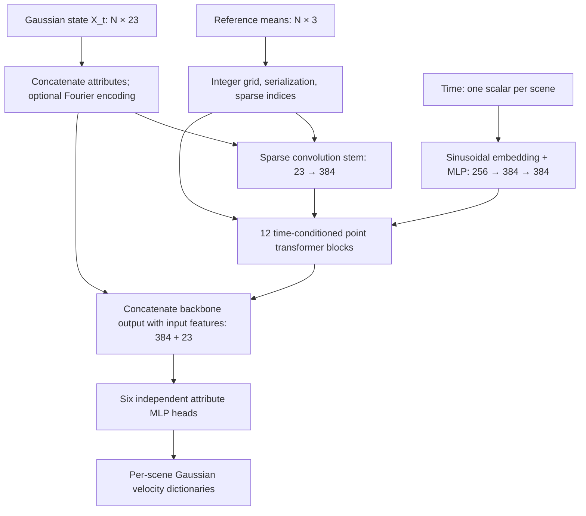

# Gaussian DiPT architecture and forward flow

This document describes the current local implementation in
[`diffusion_gaussian_predictor.py`](diffusion_gaussian_predictor.py) and
[`diffusion_gaussian_transformer.py`](diffusion_gaussian_transformer.py), including
its Pointcept dependencies and the stochastic-interpolant training pipeline.
The concrete dimensions below use [`configs/model/dipt_gaussian.gin`](../configs/model/dipt_gaussian.gin)
unless stated otherwise. Experiment environment variables and Gin overrides can
change these settings. This describes the working-tree implementation, including
its optional negative-grid-coordinate shift.

Gaussian DiPT predicts a **velocity for every Gaussian attribute at every input
point**, conditioned on continuous time. Its backbone is a flat stack of
Point Transformer blocks with time-dependent feature modulation and residual
gates. It preserves the number of points throughout the forward pass.

## 1. Overall computation

Let scene `b` contain `N_b` Gaussians, let `N = sum(N_b)`, and let `X_t` denote
the Gaussian state at interpolant time `t`. The network implements

$$
V_\theta(X_t,t;R),
$$

where `R` contains reference positions used to organize spatial computation.
`X_t` and `R` have corresponding rows, but their positions need not be equal:
the state can evolve while the reference geometry stays fixed.



The three main responsibilities are:

| Component | Responsibility |
| --- | --- |
| `DiffusionGaussianPredictor` | Pack scenes and attributes, construct spatial metadata, call the backbone, and predict attribute velocities. |
| `DiffusionGaussianTransformer` | Serialize points, build sparse features, embed time, and apply the conditioned transformer stack. |
| External interpolant pipeline | Prepare matched endpoints, standardize attributes, construct training states and targets, integrate velocities, and decode/render results. |

The predictor does not perform Gaussian matching, densification, rendering,
standardization, or the complete time integration itself.

## 2. Gaussian state and input dimensions

Each scene is a dictionary of tensors. For spherical-harmonic degree `L`, the
configured feature order and widths are:

| Attribute | Shape per scene | Meaning before statistical standardization |
| --- | --- | --- |
| `means` | `[N_b, 3]` | Gaussian centers in the loader's scene coordinate frame. |
| `scales` | `[N_b, 3]` | Logarithmic scale parameters; rendering applies `exp`. |
| `opacities` | `[N_b, 1]` | Opacity logits; rendering applies `sigmoid`. |
| `quats` | `[N_b, 4]` | Quaternion components in the selected representation. |
| `features_dc` | `[N_b, 3]` | RGB coefficients of the constant spherical-harmonic term. |
| `features_rest` | `[N_b, (L+1)^2-1, 3]` | Remaining RGB spherical-harmonic coefficients. |

The predictor flattens `features_rest` before concatenation. With all attributes
present and no Fourier encoding,

$$
C_{\mathrm{in}}=3+3+1+4+3+3((L+1)^2-1)=11+3(L+1)^2.
$$

For the configured `L=1`, this is **23 channels**, including nine channels for
`features_rest`. Input feature order is controlled by `input_features`, and
output head order by `output_features`.

### Standardization belongs to the caller

[`GaussianStandardizer`](../utils/gs_normalization.py) uses fixed aggregate
output statistics to transform each attribute component:

$$
z_k=\frac{x_k-\mu_k}{\sqrt{\max(\operatorname{var}_k,\epsilon)}}.
$$

Thus the normal operating input is the interpolated state in these coordinates,
and the prediction is its time derivative. For a standardized component, its
velocity in the original attribute coordinates is `std_k * predicted_velocity`.
The predictor itself performs no normalization or denormalization.

Quaternion behavior depends on the pipeline setting:

| Representation | Endpoint preparation and encoding |
| --- | --- |
| `raw_standardized` | Keep supplied quaternion endpoints and standardize their components. |
| `unit_unstandardized` | Normalize endpoint quaternions, optionally align paired target signs to source signs, and bypass quaternion statistical standardization. |

Both modes use additive four-component velocities. Intermediate states are not
projected onto the unit sphere, and `GaussianStandardizer.decode` does not
normalize quaternions. A predicted quaternion velocity is not itself a rotation
quaternion. The current rotation-range experiment selects `unit_unstandardized`.

### Optional Fourier feature encoding

[`utils/fourier_features.py`](../utils/fourier_features.py) supports encoding
`means`, `scales`, and `quats`. For an attribute with `d` channels and `F`
frequencies, the encoded width is

$$
d\bigl(2F+\mathbf{1}_{\text{include raw}}\bigr).
$$

The encoder concatenates optional raw values followed by sine and cosine values
at each fixed frequency. By default frequencies are powers of two, from `1` to
`2^(F-1)`; linear frequency spacing and a different maximum are configurable.
The arguments are `frequency * input`, with no extra factor of `2π`.

Encoding applies to the supplied state features, not to the reference positions
used for the grid. It also changes the input skip width at the output heads.
The supplied DiPT Gin configuration disables all attribute Fourier encoders.
This is separate from the always-used sinusoidal time embedding.

## 3. Packing multiple scenes and separating geometry from state

`forward(batch_flow_gs, batch_scene_idx, t, batch_reference_means)` packs all
scenes into one point set:

| Field | Shape | Construction |
| --- | --- | --- |
| `feat` | `[N, C_in]` | Concatenated Gaussian state features, grouped by scene. |
| `coord` | `[N, 3]` | Concatenated reference means. |
| `grid_coord` | `[N, 3]` | Quantized reference means, optionally shifted. |
| `grid_size` | `[3]` | Three copies of `1 / grid_resolution`. |
| `offset` | `[B]` | Cumulative scene counts, such as `[N_0, N_0+N_1, ...]`. |
| `timesteps` | `[B]` | One floating-point time per scene. |

A scalar time broadcasts across scenes. Otherwise, exactly `B` time values are
required. `Point` derives a per-point batch index from `offset`. Scene indices
passed in `batch_scene_idx` are discarded: there is no learned scene-ID embedding.

If references are omitted, the predictor uses each input state's `means`.
Therefore, fixed spatial neighborhoods are a property of supplying fixed
references, not an unconditional guarantee of the class. The interpolant
pipeline explicitly supplies scene-frame references rather than statistically
standardized state positions.

For grid resolution `r`, reference position `p_i` becomes

$$
g_i=\lfloor r p_i\rfloor.
$$

When `shift_negative_grid_coords=True`, each scene independently applies

$$
g'_{i,a}=g_{i,a}-\min\left(\min_j g_{j,a},0\right)
$$

for each axis `a`. Only axes with a negative minimum are translated; axes
already nonnegative retain their origin. This changes integer spatial metadata
without changing `coord` or the Gaussian feature values. It is useful after
rotations move reference points below zero. The constructor defaults to `False`;
[`dipt-rotation-range.sh`](../experiments/dipt-rotation-range.sh) enables it.

Grid construction does not merge or average points. It assigns sparse spatial
indices while retaining one feature row per input Gaussian.

## 4. Serialization and the sparse-convolution stem

The transformer first constructs a Pointcept `Point`, calls `serialization`,
and calls `sparsify`. The implementations live in
[`structure.py`](../Pointcept/pointcept/models/utils/structure.py).

Serialization computes spatial codes and sorted/inverse index maps for each
configured order. The default orders are:

- `z`: Morton/Z-order of integer `(x, y, z)` coordinates.
- `z-trans`: the same encoding with the x and y axes exchanged.

Batch IDs are encoded into the spatial keys. Attention patch construction also
respects scene boundaries. Training shuffles the list of serialization orders
once per forward call when enabled; it does not independently shuffle every
point. Block `i`, indexed from zero, selects order `i % number_of_orders`.
The configured evaluation mode disables order shuffling.

`sparsify` constructs a `spconv.SparseConvTensor` with indices
`[batch, grid_x, grid_y, grid_z]`. The grid is supplied explicitly, so Pointcept's
fallback coordinate quantization is not used.

The inherited Point Transformer `Embedding` stem is:

```text
SubMConv3d(C_in → C_0, kernel_size=5, padding=1, bias=False)
→ BatchNorm1d(C_0, eps=1e-3, momentum=0.01)
→ GELU
```

With the supplied configuration this maps `[N, 23]` to `[N, 384]`.
The submanifold convolution operates on the sparse active sites and does not
introduce a pooling stage. Batch normalization uses packed point features;
attention and sparse spatial neighborhoods remain separated by scene.

## 5. Continuous-time conditioning

`TimestepEmbedding` maps each scene's scalar time to a vector of width `C_0`.
For frequency embedding width `D` and `h = floor(D/2)`, it computes

$$
\omega_j=\exp\left(-\log(10000)\frac{j}{h}\right),\quad j=0,\ldots,h-1,
$$

$$
e(t)=[\cos(t\omega_0),\ldots,\cos(t\omega_{h-1}),
       \sin(t\omega_0),\ldots,\sin(t\omega_{h-1})].
$$

An odd `D` gets a final zero channel. The learned projection is

```text
Linear(D → C_0) → GELU → Linear(C_0 → C_0)
```

The configured dimensions are `256 → 384 → 384`, producing `[B, 384]`.
Times are used directly as continuous values; this implementation does not
multiply them by a diffusion-step count or add a time token to the point sequence.

Every block receives this shared time embedding, but has its own learned
modulation projection. There is no class-label embedder, text/image
cross-attention, or classifier-free-guidance path in this Gaussian wrapper.

## 6. One Gaussian diffusion transformer block

`GaussianDiffusionBlock` inherits its spatial and attention modules from
Pointcept's [`Block`](../Pointcept/pointcept/models/point_transformer_v3/point_transformer_v3m1_base.py).
It adds time-conditioned shifts, scales, and residual gates.

For a block of width `C`, time first passes through an identity map when
`C=C_0`, or `Linear(C_0 → C)` otherwise. The modulation network is

```text
GELU → Linear(C → 6C)
```

Its output splits into six `[B, C]` tensors:

$$
(\beta_A,\gamma_A,g_A,\beta_M,\gamma_M,g_M).
$$

These are repeated according to scene point counts, giving `[N, C]` tensors.
Every point in a scene receives the same time modulation for a given block.
Gates are unconstrained learned values; there is no sigmoid on them.

### Spatial positional encoding

The conditional positional encoding module (`cpe`) is

```text
SubMConv3d(C → C, kernel_size=3, bias=True)
→ Linear(C → C)
→ LayerNorm(C)
```

It contributes a residual update:

$$
H_c=H+\operatorname{CPE}(H).
$$

This provides local spatial interaction using the reference grid. It is not
an absolute sinusoidal position embedding, and it remains active when attention
relative positional encoding is disabled.

### Time-modulated attention and MLP

For the default `pre_norm=True`, the remaining equations are

$$
U_A=\operatorname{LN}_1(H_c)\odot(1+\gamma_A)+\beta_A,
$$

$$
H_A=H_c+g_A\odot\operatorname{DropPath}(\operatorname{Attention}(U_A)),
$$

$$
U_M=\operatorname{LN}_2(H_A)\odot(1+\gamma_M)+\beta_M,
$$

$$
H_{\mathrm{out}}=H_A+g_M\odot\operatorname{DropPath}(\operatorname{MLP}(U_M)).
$$

The MLP is `Linear(C → 4C) → GELU → Linear(4C → C)` with configurable
projection dropout. At width 384, its intermediate width is 1536.
If `pre_norm=False`, each normalization instead follows its residual addition;
the time modulation still precedes the attention or MLP branch.

The updated dense features are synchronized back into `sparse_conv_feat` at
the end of the block so the next sparse convolution uses the latest state.

Although the conditioning resembles adaptive LayerNorm with gates, **the block's
modulation layers are not explicitly zero-initialized**. The predictor's
`zeroinit` option applies to the final attribute-head layers described below.

## 7. Serialized patch attention

Attention sorts feature rows using the block's chosen spatial serialization,
partitions each scene into patches, and performs multi-head self-attention
within each patch. It then applies the inverse map to restore original row order.

For width `C`, `H` heads, and per-head width `d=C/H`:

$$
[Q,K,V]=\operatorname{Linear}_{C\to3C}(U_A),\qquad
\operatorname{Attn}(Q,K,V)=\operatorname{softmax}(QK^\top/\sqrt d)V.
$$

The result passes through a `Linear(C → C)` output projection and projection
dropout. The configured backbone has six heads of width 64.

The 12 patch sizes are:

```text
Block:       1    2     3     4    5    6     7     8    9   10    11    12
Patch size: 256  512  1024  1024  256  512  1024  1024  256  512  1024  1024
```

Patch size is the number of serialized points, not a fixed spatial radius.
Alternating orders and patch sizes changes which points communicate directly.
Repeated attention and sparse-convolution layers can propagate information
beyond one patch, without explicitly computing global all-pairs attention.

Pointcept pads incomplete patches of larger scenes by reusing point indices
and removes the padding after attention. With FlashAttention, scenes smaller
than a patch can use shorter sequences. Without FlashAttention, the effective
patch size is capped by the smallest scene in the batch.

Because patch sizes vary across blocks, this wrapper invalidates cached padding,
unpadding, sequence lengths, and relative positions when the effective patch
size changes. Reusing metadata for a different patch size would be incorrect.

FlashAttention is enabled in the supplied configuration. The inherited code
casts packed QKV to FP16 for the attention call and restores the output dtype.
This path requires `enable_rpe=False`, `upcast_attention=False`, and
`upcast_softmax=False`. The non-Flash path supports optional learned relative
position biases and attention/softmax upcasting.

For a fixed patch size `K`, attention matrix work scales approximately as
`O(NKC)`, compared with `O(N²C)` for global attention, excluding sorting,
projections, and sparse convolutions.

## 8. Flat backbone and concrete configuration

There is no encoder-decoder hierarchy, pooling, unpooling, or point generation.
The `enc` container is simply a sequence of conditioned blocks. Channel widths,
head counts, and patch sizes can be scalars repeated across depth or sequences
with one entry per block. Changing width inserts a linear projection between
blocks and uses a matching projection for the original time embedding.

| Setting | Supplied DiPT-S Gin configuration | Direct transformer constructor default |
| --- | --- | --- |
| Depth | 12 | 12 |
| Channels | 384 | 768 |
| Attention heads | 6 | 12 |
| Patch sizes | Repeated `(256, 512, 1024, 1024)` | 48 throughout |
| MLP ratio | 4, inherited default | 4 |
| Time frequency width | 256 | 256 |
| Maximum drop-path rate | 0 | 0.3 |
| Pre-normalization | True | True |
| Train order shuffling | True | True |
| Eval order shuffling | False | Inherits train setting when unspecified |
| FlashAttention | True | True |
| Attention/projection dropout | 0 / 0 | 0 / 0 |
| Attention relative position encoding | False | False |
| PDNorm | Disabled | Disabled |

When drop path is enabled, block rates increase linearly from zero to the
configured maximum. The supplied configuration therefore has no stochastic
depth. The backbone's `output_dim` is the last block width.

Optional `PDNorm` can replace stem batch normalization and/or block layer
normalization. The categorical normalization label defaults to `"Gaussian"`
and is stored separately from the numerical `time_condition`. When adaptive
PDNorm is enabled, repeated time embeddings also become its per-point context.
This is optional additional conditioning, not the default block mechanism.

## 9. Attribute heads and returned values

After the backbone, the predictor optionally concatenates the original input
feature tensor with the final hidden features:

$$
H_{\mathrm{head}}=[H_{\mathrm{backbone}},F_{\mathrm{input}}].
$$

With `input_feat_to_mlp=True`, no attribute Fourier encoding, and degree-one SH,
this yields `[N, 407] = [N, 384+23]`. This skip gives every output head direct
access to the current Gaussian state in addition to contextual features.

There is a separate MLP for each predicted attribute. With the configured two
linear layers and width 64, every head has the form

```text
Linear(407 → 64) → ReLU → Linear(64 → attribute_width)
```

The six final widths are `3, 3, 1, 4, 3, 9` in configured attribute order.
Only the `mlp-relu` head type is implemented. A one-layer setting produces a
single linear map; larger layer counts insert more hidden Linear/ReLU pairs.

Each head then applies `res_feature_activation[feature]`. The interpolant
training entry point requires all these activations to be `Identity` and
requires additive quaternion updates, so velocity values remain unconstrained.
`features_rest` is reshaped back to `[N, (L+1)^2-1, 3]`.

With `zeroinit=True`, each final linear layer has zero weights and bias.
Consequently, with identity activations the initial predictor returns zero
velocity. Hidden head layers and backbone layers retain their normal
initialization. Initially the zero final weights also block gradients from
these outputs into earlier layers until the final weights begin to change.

Finally, outputs are split at `offset` boundaries into a list of per-scene
dictionaries. Gaussian attributes present in the input but omitted from
`output_features` receive zero velocities, except the unused degree-zero SH
remainder. The current interpolant trainer requires all Gaussian attributes
as outputs.

`apply_feature_update` implements `value + step_scale * update` for any attribute.
The forward method itself returns velocities without adding them to the input.
The `resume_ckpt` value is stored by this class but not loaded here; the examined
overfit entry point rejects a non-`None` value.

## 10. Training paths and inference integration

[`sr/interpolants.py`](../sr/interpolants.py) constructs the state and exact
pathwise target velocity outside the model. Let `X_0` and `X_1` be prepared
endpoint states, and let `Z` be standard Gaussian noise. Define

$$
\gamma(t)=\sigma\sqrt{2t(1-t)},\qquad
\dot\gamma(t)=\sigma\frac{1-2t}{\sqrt{2t(1-t)}}.
$$

| Mode | State `X_t` | Target velocity | Reference positions |
| --- | --- | --- | --- |
| `linear` | `(1-t)X_0 + tX_1` | `X_1-X_0` | Source means. |
| `latent` | `(1-t)X_0 + tX_1 + γ(t)Z` | `X_1-X_0 + γ̇(t)Z` | Source means. |
| `encoding_decoding` | `cos²(πt)E + γ(t)Z` | `-π sin(2πt)E + γ̇(t)Z` | Source before `t=0.5`; target from `t=0.5`. |
| `one_sided` | `(1-t)Z + tX_1` | `X_1-Z` | Target means. |

In `encoding_decoding`, `E=X_0` before the midpoint and `E=X_1` afterward.
The implementation makes the endpoint coefficient and its derivative exactly
zero at the midpoint. Nonzero-noise square-root paths have singular endpoint
derivatives, so their training times exclude those endpoints. `one_sided`
uses standard noise directly; its formula does not multiply noise by `σ`.

The current velocity objective sums six per-attribute mean-squared errors:

$$
\mathcal L_{\mathrm{velocity}}=
\sum_k\operatorname{mean}\bigl((V_{\theta,k}-\dot X_{t,k})^2\bigr).
$$

Each attribute's mean averages over its own points and components. This is a
sum of attribute means, not one mean over the concatenated 23-channel vector.
Alternatively, the entry point can supervise the endpoint of a differentiable
rollout and optionally combine it with rendered-image losses. Loss choice does
not change the network architecture.

Inference repeatedly evaluates the velocity field with explicit Euler updates:

$$
X_{j+1}=X_j+\frac1S V_\theta(X_j,t_j;R_j),\qquad j=0,\ldots,S-1.
$$

The stage time is `j/S`; the model's time input is clamped into
`[t_eps, 1-t_eps]`. Reference selection uses the unclamped stage time.
Source-based modes start at the encoded source, while `one_sided` starts at
noise. The final state is decoded back to scene-frame attributes for rendering.
The integration loop adds no fresh noise at each step.

Target reference positions are explicitly required by `one_sided` sampling
and the decoding half of `encoding_decoding`. These modes therefore use target
geometry as part of their spatial setup. The model is time-conditioned, but
its overall prediction also depends on the supplied state and reference geometry.

## 11. Implications for the rotation-range experiment

[`experiments/dipt-rotation-range.sh`](../experiments/dipt-rotation-range.sh)
runs linear interpolation with rotation augmentation, disables jitter, enables
the negative-grid shift, and selects unit-unstandardized quaternion endpoints.
Its default rotation limits are 0, 1, 10, and 45 degrees, and its default
rotation mode is `gravity_consistent`.

These settings leave the network architecture unchanged. Rotations affect the
input attributes and spatial grid presented by the surrounding pipeline.
Axis-aligned sparse convolutions and Morton serialization do not establish
rotation equivariance; augmentation trains the model across rotated examples.
Translating negative grid axes makes their indices nonnegative, but does not
by itself make the representation invariant to rotation or translation.

## 12. Source map

| File | Relevant definitions |
| --- | --- |
| [`diffusion_gaussian_predictor.py`](diffusion_gaussian_predictor.py) | Feature widths, optional Fourier encoding, packing, grid construction, heads, output splitting. |
| [`diffusion_gaussian_transformer.py`](diffusion_gaussian_transformer.py) | Time embedding, modulation, patch-cache invalidation, flat backbone construction. |
| [`dipt_gaussian.gin`](../configs/model/dipt_gaussian.gin) | Concrete DiPT-S and Gaussian-head configuration. |
| [`point_transformer_v3m1_base.py`](../Pointcept/pointcept/models/point_transformer_v3/point_transformer_v3m1_base.py) | Sparse stem, CPE, serialized attention, MLP, normalization. |
| [`structure.py`](../Pointcept/pointcept/models/utils/structure.py) | Packed point state, serialization metadata, sparse tensor construction. |
| [`serialization/default.py`](../Pointcept/pointcept/models/utils/serialization/default.py) | Morton and transposed spatial orders. |
| [`modules.py`](../Pointcept/pointcept/models/modules.py) | `PointSequential` dispatch and dense/sparse feature synchronization. |
| [`fourier_features.py`](../utils/fourier_features.py) | Attribute Fourier encoders and encoded widths. |
| [`gs_normalization.py`](../utils/gs_normalization.py) | Fixed statistics and quaternion endpoint conventions. |
| [`gs_utils.py`](../utils/gs_utils.py) | Renderer conversion of log scales and opacity logits. |
| [`interpolants.py`](../sr/interpolants.py) | Paths, reference selection, attribute MSE, Euler integration. |
| [`overfit-sr-interpolants.py`](../overfit-sr-interpolants.py) | Endpoint preparation, training objectives, model validation. |
| [`overfit-sr-interpolants.sh`](../scripts/overfit-sr-interpolants.sh) | Predictor selection and environment-to-Gin overrides. |

This explanation is based on source inspection; it does not claim measured
throughput, trained accuracy, or a GPU execution check.
