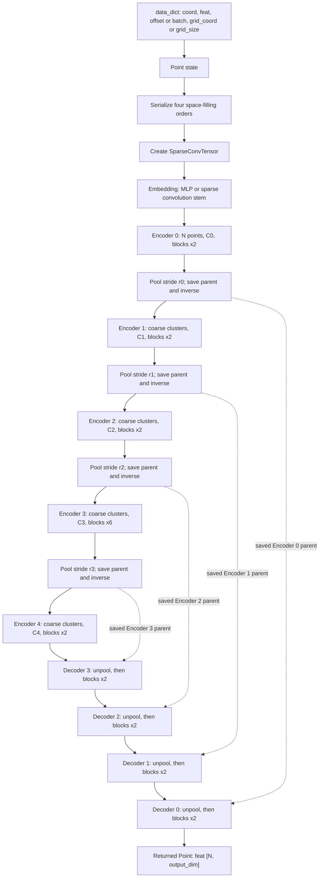

# PointTransformerV3 architecture and forward flow

`pointtransformer_v3.py` supplies the Point Transformer backbone for the `PT`
branch of `FeaturePredictor`. It is a five-level sparse point-cloud U-Net:
serialized local-attention blocks encode progressively coarser point sets, and
decoder blocks project and fuse saved fine-scale point sets back to the input
resolution. This report describes the local wrapper and the Pointcept
primitives it imports.

## Public wrapper: `PointTransformerV3Model`

The Gin-configurable wrapper constructs `self.backbone`, exposes
`output_dim = dec_channels[0]`, and returns the backbone's `Point` object
unchanged. `FeaturePredictor` builds a batched model input, calls the wrapper,
and consumes `y["feat"]`, so the expected result is one `output_dim`-wide
vector for every original input point.

### Input and persistent point state

`Point(data_dict)` requires `feat` and either `offset` or `batch`; supplying
one lets it derive the other. The usual caller supplies:

| Field | Shape / meaning | Role |
| --- | --- | --- |
| `coord` | `[N, 3]` float coordinates | Averaged by pooling; used to derive the grid when needed. |
| `feat` | `[N, C_in]` | Per-point attributes and the eventual `[N, output_dim]` output. |
| `offset` | `[B]` cumulative counts | Batch segmentation; `batch` is derived from it. |
| `grid_coord` | `[N, 3]` integer voxel coordinates | Preferred serialization and sparse-convolution grid. |
| `grid_size` | Scalar or `[3]` voxel size | Alternative to `grid_coord`; the `Point` derives `grid_coord` from `coord` and this size. |

Forward initialization adds `serialized_depth`, per-order serialized codes,
orders and inverses, plus `sparse_shape` and `sparse_conv_feat`. Pooling also
adds the parent point state and inverse cluster map that its matching decoder
stage needs.

### Configuration chosen by the wrapper

| Setting | Current behavior |
| --- | --- |
| Serialization order | `("z", "z-trans", "hilbert", "hilbert-trans")`; block `i` uses order `i mod 4`. `shuffle_orders=True` randomly permutes their rows. |
| Encoder defaults | Depths `(2, 2, 2, 6, 2)`, heads `(2, 4, 8, 16, 32)`; `enc_dim=32` selects `(32, 64, 128, 256, 512)`, while `64` selects `(64, 96, 128, 256, 512)`. |
| Decoder defaults | Depths `(2, 2, 2, 2)`, heads `(4, 4, 8, 16)`; `output_dim=64`, `96`, and `128` select `(64, 64, 128, 256)`, `(96, 96, 128, 256)`, and `(128, 128, 256, 256)`. |
| Patch size | `1024` at every configured level with FlashAttention, otherwise `128`. Without FlashAttention, the actual size is additionally capped by the smallest batch item's point count. |
| Normalization | Stem and pool/unpool projections use BatchNorm1d by default, `Identity` when `turn_off_bn=True`, or `PDNorm` with `pdnorm_bn=True`. Blocks use LayerNorm or `PDNorm` with `pdnorm_ln=True`. |
| Embedding | Wrapper-default `MLP`: `Linear(C_in, C0) -> BN/Identity -> GELU`. `PT_embedding`: sparse 5x5x5 submanifold convolution, normalization, and GELU. |

The wrapper fixes `mlp_ratio=4`, `pre_norm=True`, `drop_path=0.3`, disabled
relative positional encoding, and zero attention/projection dropout. Optional
checkpoint loading copies only `module.backbone.*` tensors whose names and
shapes match the constructed backbone.

### Complete `PointTransformerV3` argument reference

The following is the exact constructor defined in this repository, not a generic Pointcept API. Defaults are the direct `PointTransformerV3` defaults; `PointTransformerV3Model` overrides several of them, and the active `FeaturePredictor` values are listed in the next section.

#### Input, serialization, and encoder topology

| Argument | Default | Effect and constraints |
| --- | --- | --- |
| `embedding_type` | `"PT_embedding"` | Chooses the input stem. `PT_embedding` creates the Pointcept sparse-convolution stem; `MLP` creates `Linear(in_channels, enc_channels[0])`, normalization, and GELU. The wrapper default is `MLP`. Other strings leave no embedding module and are invalid in practice. |
| `in_channels` | `6` | Width of input `point.feat`. Must equal the concatenated feature width provided by the caller. The active `FeaturePredictor` supplies 23 channels. |
| `order` | `("z", "z-trans")` | One string or a sequence of serialization orders. A string is converted to a one-element sequence. Each block uses `order_index = block_index mod len(order)`. The wrapper supplies four orders: Z-order, transposed Z-order, Hilbert, and transposed Hilbert. |
| `stride` | `(2, 2, 2, 2)` | One pooling stride between each adjacent encoder level. Its length must be `len(enc_depths) - 1`. Serialized pooling accepts powers of two, including 1; stride `r` drops `log2(r)` bits from each coordinate axis. |
| `enc_depths` | `(2, 2, 2, 6, 2)` | Number of `Block`s at each encoder level. Its length defines the number of encoder stages. |
| `enc_channels` | `(32, 64, 128, 256, 512)` | Per-level encoder widths. Length must equal `enc_depths`; every width must divide evenly by its corresponding `enc_num_head` value. |
| `enc_num_head` | `(2, 4, 8, 16, 32)` | Attention heads per encoder level. Each head has width `enc_channels[level] / enc_num_head[level]`. |
| `enc_patch_size` | `(48, 48, 48, 48, 48)` | Maximum serialized-attention patch length per encoder level. Length must equal `enc_depths`. With FlashAttention this is the kernel maximum sequence length; without it, it is an upper bound on the dynamically selected patch length. |

#### Decoder topology

| Argument | Default | Effect and constraints |
| --- | --- | --- |
| `dec_depths` | `(2, 2, 2, 2)` | Number of `Block`s after each decoder unpooling stage. Required to have one fewer item than `enc_depths` unless `cls_mode=True`. |
| `dec_channels` | `(64, 64, 128, 256)` | Decoder output widths ordered from finest to coarsest (`dec0` through `dec3`). The implementation appends the coarsest encoder width internally to form each unpooling input width. |
| `dec_num_head` | `(4, 4, 8, 16)` | Attention heads for `dec0` through `dec3`; every decoder width must divide evenly by its head count. |
| `dec_patch_size` | `(48, 48, 48, 48)` | Maximum serialized-attention patch length for `dec0` through `dec3`. |
| `cls_mode` | `False` | When false, construct the U-Net decoder and return full-resolution point features. When true, skip decoder construction. The intended scene-level mean reduction is commented out in this local source, so classification mode currently returns the coarsest `Point` rather than classifier-ready pooled features. |

#### Block, attention, and regularization

| Argument | Default | Effect and constraints |
| --- | --- | --- |
| `mlp_ratio` | `4` | Hidden-width multiplier in every block MLP: `C -> int(C * mlp_ratio) -> C`. |
| `qkv_bias` | `True` | Enables bias in the linear projection that produces concatenated query, key, and value tensors. |
| `qk_scale` | `None` | Explicit attention scale. When `None`, attention uses the usual `(head_dim)^-0.5` scale. |
| `attn_drop` | `0.0` | Dropout applied to attention probabilities in the non-Flash path, or passed as FlashAttention dropout during training. |
| `proj_drop` | `0.0` | Dropout after the attention output projection and after both MLP linear layers. |
| `drop_path` | `0.3` | Maximum stochastic-depth rate. The implementation linearly schedules rates from 0 to this value over encoder blocks and separately over decoder blocks. It is active only in training mode. |
| `pre_norm` | `True` | If true, apply LayerNorm/PDNorm before attention and MLP. If false, normalize after each residual addition. |
| `shuffle_orders` | `True` | Randomly permutes serialization-order rows during initial serialization and every pooling operation. It changes which traversal each numbered block receives on each forward pass, including evaluation. |
| `enable_rpe` | `False` | Enables learned relative-position bias from quantized grid-coordinate differences in the non-Flash attention path. It is incompatible with FlashAttention. |
| `enable_flash` | `True` | Uses FlashAttention variable-length packed QKV kernels. Requires the `flash_attn` package and requires `enable_rpe=False`, `upcast_attention=False`, and `upcast_softmax=False`. The wrapper selects 1024-sized patches when true and 128-sized patches otherwise. |
| `upcast_attention` | `False` | In non-Flash attention, casts query and key to float32 before the QK product for numerical stability. Must be false with FlashAttention. |
| `upcast_softmax` | `False` | In non-Flash attention, casts attention logits to float32 before softmax. Must be false with FlashAttention. |

#### Normalization and Point Prompt Training compatibility

| Argument | Default | Effect and constraints |
| --- | --- | --- |
| `pdnorm_bn` | `False` | Replaces stem/pooling/unpooling BatchNorm with `PDNorm`. Takes precedence over `turn_off_bn`. The input `Point` must then provide a recognized `condition`. |
| `turn_off_bn` | `False` | When `pdnorm_bn=False`, replaces stem/pooling/unpooling BatchNorm with `Identity`. It does not change block LayerNorm. |
| `pdnorm_ln` | `False` | Replaces block LayerNorm with `PDNorm`; again requires `Point.condition`. |
| `pdnorm_decouple` | `True` | PDNorm-only: maintain one independent normalization module for each entry in `pdnorm_conditions`. False uses a single shared normalization module. |
| `pdnorm_adaptive` | `False` | PDNorm-only: modulates normalized features with a `Point.context` embedding through a learned shift and scale. Requires `context` at forward time. |
| `pdnorm_affine` | `True` | PDNorm-only affine setting forwarded to the underlying BatchNorm1d or LayerNorm instance. |
| `pdnorm_conditions` | `("ScanNet", "S3DIS", "Structured3D")` | Ordered condition labels understood by PDNorm. With decoupling, the selected label chooses its normalization module. It has no effect while both PDNorm flags are false. |

The wrapper fixes `order`, `mlp_ratio`, `qkv_bias`, `qk_scale`, `attn_drop`, `proj_drop`, `drop_path`, `shuffle_orders`, `pre_norm`, RPE, Flash-related upcasting, `cls_mode`, and the PDNorm compatibility arguments. `FeaturePredictor` supplies `in_channels`; Gin configures the wrapper choices such as stride, channel preset, embedding type, and optional custom tuples.

### Configuration selected by `FeaturePredictor`

The repository standard PT configuration is [`configs/model/ptv3.gin`](../configs/model/ptv3.gin). Training and overfit scripts select this file, although command-line Gin overrides can still change its values. The resulting configuration is:

| Area | Selected value | Consequence |
| --- | --- | --- |
| Backbone | `FeaturePredictor.backbone_type = "PT"` | `FeaturePredictor` constructs `PointTransformerV3Model`, not the sparse-convolution alternative. |
| Input features | `means`, `scales`, `opacities`, `quats`, `features_dc`, `features_rest`; `sh_degree=1` | Packed input width: `3 + 3 + 1 + 4 + 3 + 9 = 23`. `features_rest` has three non-DC SH coefficients per color channel. |
| Grid | `grid_resolution=384` | `grid_coord = floor(means * 384)` and `grid_size = 1 / 384` in `FeaturePredictor.forward`. |
| Stem and widths | `embedding_type="MLP"`, `enc_dim=64`, `output_dim=96` | MLP stem maps `23 -> 64`; encoder channels are `(64, 96, 128, 256, 512)` and decoder channels are `(96, 96, 128, 256)`. |
| Scale changes | `stride=(1, 2, 2, 2)` | Encoder 1 uses stride 1, preserving serialization depth; each later transition coarsens by factor 2 on every coordinate axis and can group up to `2 x 2 x 2 = 8` occupied voxels. Actual point counts depend on occupied-code clusters. |
| Attention | `enable_flash=True` | All encoder and decoder patch-size limits are `1024`; the FlashAttention path is used. |
| Normalization | `turn_off_bn=False`, `pdnorm_bn=False`, `pdnorm_ln=False` | BatchNorm1d is active outside blocks and ordinary LayerNorm is active inside blocks. |
| Block counts and heads | No Gin override | Encoder depths/heads: `(2, 2, 2, 6, 2)` / `(2, 4, 8, 16, 32)`; decoder depths/heads: `(2, 2, 2, 2)` / `(4, 4, 8, 16)`. |
| Output heads | Four-layer ReLU MLPs, width `256`; `input_feat_to_mlp=True` | Each head receives the 96-channel backbone result plus the 23-channel input: 119 channels. All Gaussian attributes are zero-initialized residuals; `means` uses `tanh` and the others use identity. |

Encoder head dimensions are `(32, 24, 16, 16, 16)` and decoder head dimensions are `(24, 24, 16, 16)`. The first stride being one is intentional: it still runs pooling, records a skip mapping, and projects channels from 64 to 96.

### Terminology

| Term | Meaning in this implementation |
| --- | --- |
| **Stage / level** | One resolution in the U-Net. There are five encoder levels (`0` is finest) and four decoder levels that restore levels `3` through `0`. |
| **Depth** | Number of transformer `Block`s repeated at one stage; it is not 3D-coordinate or serialization depth. Encoder level 3 has depth 6, so it applies six blocks at 256 channels. |
| **Channels / width** | Feature-vector length per point at a stage. The selected encoder widens from 64 to 512 channels; final decoder output width is 96. |
| **Heads** | Independent attention partitions. A block divides channel width `C` evenly into `H` heads, each with dimension `C / H`; 128 channels and 8 heads gives 16 values per head. |
| **Patch size** | Maximum serialized-neighbor point count processed together by local attention. It is a token-count limit (`1024` here), not a spatial voxel size or pooling factor. |
| **Stride** | Requested coarsening factor at an encoder transition. It drops bits from serialized codes and groups equal codes; only powers of two, including 1, are supported. |
| **Serialization depth** | Bit depth of the coordinate cube used to form a 3D space-filling-curve code. It derives from the input grid extent and decreases when pooling drops coordinate bits. |
| **Serialization order** | Space-filling traversal (`z`, transposed Z-order, Hilbert, or transposed Hilbert) that defines which points are local neighbors in a patch. |
| **Embedding / stem** | Initial feature projection before the encoder. This configuration uses an MLP; only `PT_embedding` selects the sparse-convolution stem. |
| **MLP ratio** | Hidden-width multiplier in a block feed-forward network. `mlp_ratio=4` expands `C -> 4C -> C`. |
| **Pre-norm** | LayerNorm is applied before attention and before the MLP; each result then passes through a residual addition. |
| **Drop path** | Training-time stochastic depth on attention and MLP residual branches. Its rate increases linearly across blocks from 0 to 0.3. |

## End-to-end forward flow



Each transition with stride `r` drops `log2(r)` bits from each of the three coordinate axes. A stride of 2 therefore forms 2-by-2-by-2 spatial code cells and may combine up to 8 occupied voxels; output counts equal the number of unique coarse serialization-code clusters, not a fixed division of `N`. For the common `enc_dim=32` configuration,
`(C0, C1, C2, C3, C4) = (32, 64, 128, 256, 512)`.

### Stage layout (generic `enc_dim=32`, `output_dim=64` preset)

| Path | Level | Approx. points | Channels | Work |
| --- | ---: | ---: | ---: | --- |
| Encoder | 0 | `N` | `C0 = 32` | Stem output, then 2 blocks. |
| Encoder | 1 | clusters after stride `r0` | `C1 = 64` | Project, max-pool serialized clusters, then 2 blocks. |
| Encoder | 2 | clusters after strides `r0, r1` | `C2 = 128` | Project, max-pool, then 2 blocks. |
| Encoder | 3 | clusters after strides `r0, r1, r2` | `C3 = 256` | Project, max-pool, then 6 blocks. |
| Encoder | 4 | clusters after strides `r0, r1, r2, r3` | `C4 = 512` | Project, max-pool, then 2 blocks. |
| Decoder | 3 | Encoder level 3 | `D3 = 256` | Project coarse and skip features, gather by inverse, add, then 2 blocks. |
| Decoder | 2 | Encoder level 2 | `D2 = 128` | Same reconstruction pattern, then 2 blocks. |
| Decoder | 1 | Encoder level 1 | `D1 = 64` | Same reconstruction pattern, then 2 blocks. |
| Decoder | 0 | `N` | `D0 = output_dim` | Same reconstruction pattern, then 2 blocks. |

The table uses the default `output_dim=64` schedule
`(D0, D1, D2, D3) = (64, 64, 128, 256)`. The other supported `output_dim`
values and custom channel tuples change these widths. The constructor asserts
five encoder levels and four decoder levels when `cls_mode=False`.

## Core primitives

### Serialized local attention

Serialization converts quantized coordinates and batch index into a
space-filling-curve code. Attention gathers a selected serialized order into
fixed-size local patches, pads each batch item's tail by repeating valid
indices, computes attention, then uses the inverse mapping to restore original
point order.

```text
feat -> Linear(C, 3C) -> reorder and patch -> Q, K, V
     -> softmax((Q / sqrt(head_dim)) K^T [+ optional RPE]) V
     -> restore point order -> Linear(C, C) -> dropout
```

With `enable_flash=False`, this is standard scaled dot-product attention. With
`enable_flash=True`, Pointcept calls FlashAttention's variable-length packed
QKV kernel; it requires RPE and both upcast options to be disabled, which this
wrapper enforces.

### Transformer block

Every encoder and decoder stage repeats this pre-normalized residual block:

```text
feat
  -> sparse 3x3x3 submanifold convolution -> Linear -> norm -> add residual
  -> LayerNorm -> serialized attention -> DropPath -> add residual
  -> LayerNorm -> MLP(C -> 4C -> C, GELU) -> DropPath -> add residual
```

The block writes its final feature matrix back to `point.sparse_conv_feat`, so
the next sparse convolution sees current features. The code supports post-norm,
but the local wrapper fixes `pre_norm=True`.

### Serialized pooling and unpooling

`SerializedPooling` drops low bits from the first serialization code for a
power-of-two stride (`2`, `4`, or `8`), groups equal coarse codes, projects
features, and applies `torch_scatter.segment_csr(..., reduce="max")`. It
averages coordinates, rebuilds serialized mappings for coarse points, and
saves:

- `pooling_parent`: the entire finer `Point` state.
- `pooling_inverse`: every finer point's coarse-cluster assignment.

`SerializedUnpooling` pops those artifacts, projects coarse and fine features
to the decoder width, gathers coarse features with `pooling_inverse`, adds them
to the projected skip features, and returns the finer parent point. Thus each
decoder level restores that parent level's coordinates and serialization state.

## Output behavior and implementation notes

In the intended non-classification path, the model returns the full-resolution
`Point`, not a tensor or an intermediate decoder map. Callers read
`point.feat`; attention reordering is undone before output, preserving the
original concatenated input-point order. `cls_mode` is not a complete alternate
output path: it skips decoder construction, while the scene-level reduction is
commented out.

Two integration details are important:

1. The local module imports `Block`, `Embedding`, `SerializedPooling`, and
   `SerializedUnpooling` from `pointcept.models.point_transformer_v3`. Its
   initializer wildcard-imports `point_transformer_v3m1_base` and then
   `point_transformer_v3m1_time`; the latter shadows shared exported names.
   The time variants add optional time embedding, but this wrapper omits
   `T_dim`, so that behavior remains disabled (`-1`).
2. `PointSequential_intermediate_output` records `feat`, the first serialized
   code, and `input["pooling_inverse"]` after every decoder stage.
   `SerializedUnpooling` removes a coarse stage's inverse and returns its
   finer parent. After `dec0`, that parent is encoder level 0, which the normal
   `FeaturePredictor` input never pooled and therefore does not contain
   `pooling_inverse`. The final capture is therefore expected to raise
   `KeyError: 'pooling_inverse'` unless a caller supplies that field or the
   container changes. The collected intermediate map is also discarded because
   `PointTransformerV3.forward` returns only `point`.

These are observations of the current implementation, not proposed behavior
changes.

