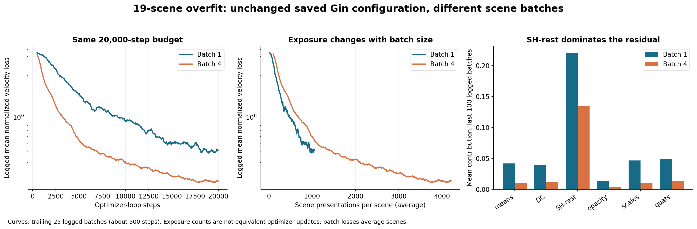
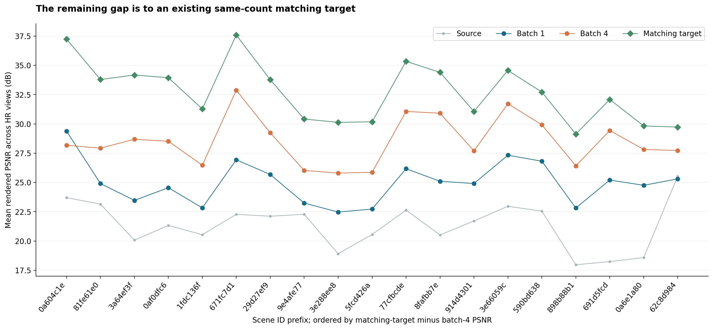

# Why 19 scenes are harder to overfit with the shared GS flow model

**Your observation is a multi-scene memorization problem for 3DGS super-resolution. The earlier discussion of diverse generation and point creation does not explain this particular failure.** For the fixed, aligned source/target Gaussians in these runs, the relevant question is whether one shared velocity network can reproduce all 19 target mappings.

I inspected `overfit-sr-gsfm.py`, `experiments/var.sh`, the launcher, optimizer construction, and saved logs/configurations/metrics from September 10–11. The results show a genuine remaining fitting gap, but they also show substantial optimization sensitivity. They do **not yet isolate insufficient PTv3 parameter capacity**.

## Strongest evidence: two completed 19-scene runs

The September 11 grid-2048 runs have **identical saved operative Gin configurations, identical selected scenes, and identical saved Gaussian rendering baselines**. Logged scene batch sizes differ. Both use the 47.96M model, 20,000 optimizer-loop steps, `matching` variance normalization, zero flow noise, `fm-only`, no BatchNorm or drop path, and linear LR decay. Their final evaluations use 10 Euler steps.

| Measurement | Batch 1 | Batch 4 |
|---|---:|---:|
| Scene samples presented across training | 20,000 | 80,000 |
| Average presentations per scene | 1,053 | 4,211 |
| Mean total velocity loss, last 100 logged batches | 0.4109 | 0.1832 |
| Final scene-mean PSNR | 24.98 dB | 28.54 dB |
| Final scene-mean SSIM | 0.8383 | 0.9090 |
| Final scene-mean LPIPS | 0.2005 | 0.1372 |

**The same configured architecture improves by 3.56 dB and cuts the logged tail loss by 55.4%.** This demonstrates sensitivity to batching and the number of scene/time samples. It does not separate reduced gradient noise, better temporal coverage, different optimization trajectories, or lower cross-scene interference. The runs are not paired-seed replications of a formally controlled study, and the saved configuration does not archive every historical code detail.

These losses are sampled training losses logged every 20 steps, not exhaustive per-scene validation. The last 100 entries cover approximately the last 2,000 optimizer-loop steps. Curves smooth 25 entries. In particular, an average over batch-4 losses has lower sampling variance than an average over the same number of batch-1 entries.

## The model still falls short of an attainable target representation

The saved baseline scene means for these exact 19 scenes are:

| Gaussian set rendered against HR images | PSNR | SSIM | LPIPS |
|---|---:|---:|---:|
| Source LR Gaussians | 21.35 | 0.7998 | 0.2073 |
| Matching targets, same number of Gaussian slots | **32.71** | **0.9620** | **0.0899** |
| Original HR Gaussians | 33.62 | 0.9741 | 0.0683 |
| Shared model, batch 4 | **28.54** | **0.9090** | **0.1372** |

The batch-4 model is **4.16 dB below its matching targets**. That gap cannot be attributed solely to insufficient Gaussian count or SH degree: those targets already use the supervised same-count representation. This establishes a network-learning/rollout gap, not whether the cause is capacity, conditioning, or optimization. The original HR set is a different representation and is not the exact parameter target of the default LR-to-HR matching objective.

Matching-target PSNR is a reference for exact imitation, not a mathematical upper bound on every possible Gaussian configuration. An optimized set could render better. Also, “perfect overfit” should distinguish matching Gaussian parameters, matching their rendered images, and matching the original HR images; these are different targets.

The gap is uneven. Scene `0a604c1e…` has batch-4 PSNR 28.18 versus a matching-target PSNR of 37.25, a 9.08 dB deficit. Batch 4 does not improve every scene: paired changes range from −1.21 to +5.95 dB. Use same-scene comparisons and per-scene gaps rather than only averages across differently composed subsets.

## Most concrete remaining optimization issue: SH-rest

| Normalized velocity-loss term | Batch 1 tail mean | Batch 4 tail mean |
|---|---:|---:|
| Position | 0.041639 | 0.010033 |
| DC color | 0.039618 | 0.011359 |
| SH-rest | **0.220717** | **0.133926** |
| Opacity | 0.014017 | 0.004164 |
| Scale | 0.046421 | 0.010553 |
| Quaternion | 0.048468 | 0.013159 |

**SH-rest contributes 73.1% of the batch-4 residual loss.** The optimizer gives its entire output-head MLP an initial LR of **1.5e-6**, compared with **3e-4** for the backbone and most other heads, and **3e-3** for the scale head. SH-rest therefore learns at a 200× smaller initial rate than the backbone, decaying on the same schedule. See [optimizer group construction](../../utils/optimizers.py) and [overfit Gin settings](../../configs/overfit/sr_gsfm.gin).

This is a specific and inexpensive-to-implement ablation: test SH-rest LR **1.5e-5**, then **1.5e-4**, while keeping everything else fixed. These are proposed test values, not proven stable optima. The head's changing backbone inputs also make an extremely slow head a plausible tracking bottleneck. Measure raw SH errors and rendered quality as well as normalized loss; a 73% loss share does not mean SH-rest causes 73% of the PSNR deficit. Position, scale, and opacity remain nonzero and can be visually sensitive.

## Scene count and training budget are confounded

| Run | Steps | Batch | Presentations / scene | Tail velocity loss |
|---|---:|---:|---:|---:|
| 1 scenes (Sep 10) | 10,000 | 1 | 10,000 | 0.0151 |
| 15 scenes (Sep 10) | 20,000 | 1 | 1,333 | 0.3152 |
| 19 scenes (Sep 10) | 20,000 | 1 | 1,053 | 0.4465 |
| 2 scenes (Sep 10) | 10,000 | 1 | 5,000 | 0.0468 |
| 4 scenes (Sep 10) | 10,000 | 1 | 2,500 | 0.1646 |
| 8 scenes (Sep 10) | 20,000 | 1 | 2,500 | 0.1049 |
| 19 scenes (Sep 11) | 20,000 | 1 | 1,053 | 0.4109 |
| 19 scenes (Sep 11) | 20,000 | 4 | 4,211 | 0.1832 |

Presentations per scene are approximately `optimizer_loop_steps × batch_size / scene_count`. Each presentation includes the scene's full Gaussian set and one newly sampled t. Scene selection uses shuffled passes over the selected scenes, so exposure is roughly balanced. The final scene sets for different counts are independently sampled; they are not necessarily nested.

At batch 1, a 19-scene run receives about 9.5× fewer presentations per scene than the 10,000-step single-scene run, despite twice as many total steps. The 19-scene batch-4 run almost matches the two-scene run's 5,000 presentations per scene. Thus exposure alone is not a complete explanation of the remaining batch-4 gap.

**Batch averaging matters:** losses are summed over a microbatch and divided by the total scene batch size. Batch 4 does not deliver four times the gradient magnitude or four independent optimizer updates. In an idealized uniform sampling calculation, a given scene contributes `1/19` of the expected batch-mean gradient at either batch size. Matching presentation counts controls temporal sampling exposure, but does not make optimization trajectories equivalent. The exposure-axis plot also shows that batch 4 does not consistently beat batch 1 at comparable presentation counts; the larger batch advantage at 20,000 steps should not be described as proof of intrinsically superior optimization per sample. Report steps, scene samples, elapsed time, and learning-rate schedule together.

The batching code appears correctly normalized by inspection, including unequal microbatch sizes: all microbatch sums are divided by `batch_size`, gradients accumulate, and one optimizer step follows. `grad_accum_steps` splits the effective scene batch; it does not multiply it. BatchNorm is disabled. There is no obvious extra division by scene count in this loop.

The linear scheduler decays to nearly zero before the demonstrated fitting gap closes. Batch-1 logged loss falls from roughly 0.497 to 0.469 to 0.411 over the last three 2,000-step windows; batch 4 gives 0.212, 0.187, 0.183. That is compatible with remaining optimization work, though it is not evidence that arbitrary extra training must solve the problem.

## How I would test capacity now

| Order | Controlled test | Interpretation |
|---|---|---|
| 0 | Train the worst-gap scene from the 19-scene set alone, with the same settings | Tests whether that particular scene is individually fit-able; success on a different one/two-scene subset does not establish this |
| 1 | Keep the completed 19-scene batch-4/grid-2048/matching baseline and increase only SH-rest LR | Tests the clearest observed per-head optimization imbalance |
| 2 | Extend training and the LR schedule to 50k–100k steps; hold the model and other settings fixed | Tests whether the current schedule stops useful fitting early; compare both curves and final errors |
| 3 | Disable training serialization shuffling as a separate experiment | Removes changing attention neighborhoods during memorization and makes train/eval ordering agree; fewer traversals may hurt, so this is diagnostic |
| 4 | Give the model the frozen source attributes throughout the flow, or a pooled source-scene feature | Tests whether identifying the source mapping becomes difficult across many scenes as x(t) evolves |
| 5 | Add a learned scene embedding as an overfit-only diagnostic | If this substantially helps, scene separation/conditional memorization deserves attention; it does not demonstrate generalization to unseen scenes |
| 6 | Compare decoder width 128 (53.15M total), doubled decoder depth (56.01M), then 1.5× widths (107.50M) under matched optimization | Tests capacity after controlling the obvious alternatives |

The model currently discards `batch_scene_idx`; the scene set is differentiated through input attributes and geometry, not an explicit identifier. This is entirely valid for generalization, but similar local neighborhoods across independently fitted scenes may demand different updates. That makes source/global conditioning a more targeted hypothesis than simply adding coarse encoder blocks. None of these conditioning ablations has been run for this report.

A learned scene embedding is a diagnostic of conditional memorization, not a production solution by itself: improvement also adds capacity and changes optimization, so it is not a uniquely identifying causal test. Compare it to a similarly sized source-derived conditioning branch.

For zero-noise straight paths, the target per-slot velocity `x_target − x_source` is constant with respect to t. A direct source-to-residual model, or a t=0-only regression diagnostic, would therefore test how much of the difficulty comes from learning the whole interpolated-state field. Good t=0 fit with poor multi-time/rollout behavior would shift suspicion toward conditioning or flow training; t=0 regression alone is not a complete flow solution. I would now put this diagnosis ahead of expanding the tiny time embedding: the 1→19-scene change is not by itself evidence that time encoding is inadequate.

Evaluate teacher-forced velocity error at fixed times, including near t=0, alongside free-running Euler outputs and per-attribute endpoint errors. Check 1/5/10/20 steps using the same checkpoint. In the September 10 19-scene run, moving from 5 to 20 steps changed mean PSNR from 24.63 to 24.52, so simply increasing Euler steps did not resolve that run. Low interpolation loss without good rollout would be a different failure from high interpolation loss.

## Interpretation of the current var.sh

The active command selects **19 scenes, batch 4, grid 1024, and precomputed aggregate variance**. Relative to the completed grid-2048/batch-1/matching baseline, it changes three factors at once; relative to the completed batch-4 run, it still changes grid and loss normalization together. Any improvement cannot be uniquely attributed to batch size or capacity.

`matching` divides each scene/channel's error by its own estimated target-velocity variance. `precomputed_aggregate` uses shared precomputed channel variances. They produce different weighting across scenes; their scalar losses are not directly comparable. The aggregate mean is reported but is not subtracted by the loss function. Compare raw errors, same-view rendering, and scene-wise target gaps across those runs.

At the inspected log snapshot, the grid-1024/aggregate run had only early training entries and no final metrics. It cannot yet be compared as a completed run. The completed analyses above use saved metrics, not the current launcher contents as a reconstruction of historical settings.

**Working diagnosis:** a real shared-model fitting gap, with demonstrated sensitivity to batching and a strong SH-rest optimization imbalance. Architectural capacity or insufficient scene context remain plausible, but “PTv3 has too few parameters” is not yet established. The next informative experiments are a controlled SH-rest LR sweep and an extended schedule, followed by source/scene conditioning and decoder scaling.

## Evidence and reproducibility

- [Extracted log data, metrics, configuration hashes, and complete run paths](run_evidence.json).
- [Analysis and plotting script](analyze_runs.py): reads existing files only; no checkpoint loading or training.
- [Current overfit loop](../../overfit-sr-gsfm.py), [launcher](../../scripts/overfit-sr-gsfm-on-objaverse.sh), [var.sh](../../experiments/var.sh).
- [Earlier architecture and exact parameter audit](../ptv3_capacity_2026-09-11/architecture_and_parameters.md).

Run `/home/ricky/miniconda3/envs/splatformer/bin/python reports/ptv3_19_scene_overfit/analyze_runs.py` from the repository to regenerate the evidence snapshot and charts. The report's numerical narrative refers to the inspected snapshot; rerunning on evolving logs can produce newer evidence. No training scripts, model files, or experiments were changed by this analysis.
