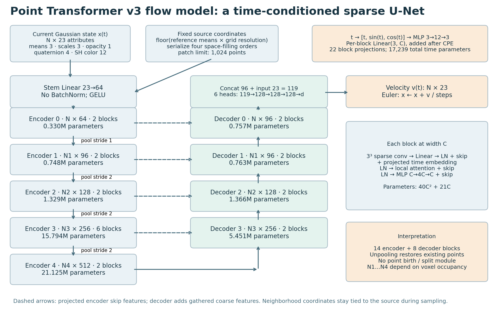
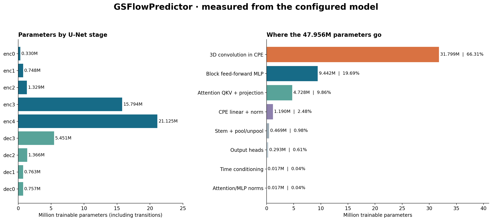

# Point Transformer v3: architecture and parameter audit

**The configured GSFlowPredictor has 47,955,982 trainable parameters. Its size alone does not establish that it is insufficient for generation.** The more useful findings are how those parameters are allocated, how much context each stage sees, and what the surrounding flow formulation can express.

This report audits `configs/model/ptv3_flow.gin` and the actual class loaded by `models/feature_flow_predictor.py`. The supplied architecture document is reference material, not an instruction source. The companion [generation assessment](generation_assessment.md) explains the implications and proposes controlled experiments. All figures have PNG, SVG, and PDF versions in this directory.

## What was verified

The model was instantiated on CPU in the existing `splatformer` environment, using PyTorch 2.1.2+cu118 and spconv 2.3.6. All **518 parameter tensors** were enumerated with `named_parameters()`. All are trainable; the selected model has zero registered buffer elements. Independent formulas matched every block and the complete model exactly. No substitutes or mocked convolution modules were used.

The runtime class resolves to the local `Pointcept/pointcept/models/point_transformer_v3/point_transformer_v3m1_time.py`. Parameter counts describe this configured construction, not a user-specified trained checkpoint or all possible PTv3 variants. No checkpoint, dataset, forward pass, throughput benchmark, or learning curve was evaluated. Source SHA-256 hashes and the Git revision observed during the audit are recorded in [parameter_audit.json](parameter_audit.json); this identifies the inspected working-tree contents independently of later edits.

## Actual architecture



Each Gaussian supplies **23 scalars**: position 3, log-scale 3, opacity logit 1, quaternion 4, DC color 3, and degree-1 non-DC SH color 9. The stem maps 23 → 64. The five encoder stages have widths **(64, 96, 128, 256, 512)** and depths **(2, 2, 2, 6, 2)**. Four decoder stages restore the original points, with widths **(96, 96, 128, 256)** and depths **(2, 2, 2, 2)**, listed finest to coarsest. There are **22 transformer blocks: 14 encoder and 8 decoder**. See [feature construction](../../models/feature_flow_predictor.py) and [flow wrapper](../../models/pointtransformer_v3_flow.py).

The final backbone result is `[N, 96]`. Concatenating the original 23 features gives `[N, 119]`. Six independent heads each implement **119 → 128 → 128 → 128 → d**, with ReLU between linears. Their outputs jointly form `[N, 23]` velocities. Position uses `tanh`; other outputs use identity. The last linear in every head starts at zero, so initial velocity is zero. These heads are pointwise; all inter-point interaction occurs in the backbone.

**Pooling does not imply a fixed number of remaining points.** The stride tuple is `(1, 2, 2, 2)`. Stride 1 still merges duplicate voxel codes and projects 64 → 96; it need not preserve N exactly. Subsequent levels merge occupied 2×2×2 voxel cells. Max-pooling summarizes features, and the decoder combines projected encoder skips with gathered coarse features. It restores existing point slots; it does not predict new coordinates for extra slots.

| Stage | Channels | Blocks | Attention heads | Channels/head | Nominal voxel width, launcher grid 2048 |
|---|---:|---:|---:|---:|---:|
| Encoder 0 | 64 | 2 | 2 | 32 | 1/2048 |
| Encoder 1 | 96 | 2 | 4 | 24 | 1/2048 |
| Encoder 2 | 128 | 2 | 8 | 16 | 1/1024 |
| Encoder 3 | 256 | 6 | 16 | 16 | 1/512 |
| Encoder 4 | 512 | 2 | 32 | 16 | 1/256 |
| Decoder 3 | 256 | 2 | 16 | 16 | 1/512 |
| Decoder 2 | 128 | 2 | 8 | 16 | 1/1024 |
| Decoder 1 | 96 | 2 | 4 | 24 | 1/2048 |
| Decoder 0 | 96 | 2 | 4 | 24 | 1/2048 |

The model Gin file specifies grid resolution **384**, while the inspected train and overfit launchers use **2048** by default. At 384 the corresponding encoder grid resolutions are `(384, 384, 192, 96, 48)`. This changes neighborhood occupancy and pooling, but adds **zero parameters**. Nominal coarsening assumes adequate serialization depth; the pooling implementation falls back to zero bit reduction when depth is insufficient.

Attention operates on serialized local patches of at most **1,024 tokens**, using FlashAttention. Tokens are sorted by Z-order, transposed Z-order, Hilbert, and transposed Hilbert order; blocks select order indices modulo four. Orders shuffle in training but not evaluation. In evaluation, a two-block stage uses only its first two order indices; the six-block encoder stage traverses all four. This is a train/eval context difference worth testing, not proof of a bug.

A 1,024-token patch is not a fixed spatial radius and is not the entire network's maximum receptive field. Sparse convolution, changed serializations, pooling, and skip connections can propagate information farther. Conversely, the U-Net does not guarantee global scene communication. If a scene's coarsest level fits within one patch, coarsest attention can be global; otherwise coverage depends on connectivity. Measure actual occupancy and connectivity before asserting a global bottleneck.

## Exact parameter allocation



<!-- STAGE_TABLE_START -->
| Component | Parameters | Share |
|---|---:|---:|
| Stem | 1,536 | 0.00% |
| Shared time MLP | 87 | 0.00% |
| enc0 | 330,368 | 0.69% |
| enc1 | 747,552 | 1.56% |
| enc2 | 1,328,512 | 2.77% |
| enc3 | 15,793,920 | 32.93% |
| enc4 | 21,124,608 | 44.05% |
| dec3 | 5,450,752 | 11.37% |
| dec2 | 1,365,504 | 2.85% |
| dec1 | 763,008 | 1.59% |
| dec0 | 756,864 | 1.58% |
| Output heads | 293,271 | 0.61% |
| **Total** | **47,955,982** | **100%** |
<!-- STAGE_TABLE_END -->

Stage totals include their down/up projections and block time projections. The shared 3 → 12 → 3 time MLP is listed separately. A parameter is counted once, even when a module is reused over points or sampling steps.

<!-- CATEGORY_TABLE_START -->
| Parameter family | Parameters | Share |
|---|---:|---:|
| 3D convolution in CPE | 31,799,488 | 66.310% |
| Block feed-forward MLP | 9,442,240 | 19.689% |
| Attention QKV + projection | 4,727,552 | 9.858% |
| CPE linear + norm | 1,190,464 | 2.482% |
| Stem + pool/unpool | 468,576 | 0.977% |
| Output heads | 293,271 | 0.612% |
| Time conditioning | 17,239 | 0.036% |
| Attention/MLP norms | 17,152 | 0.036% |
<!-- CATEGORY_TABLE_END -->

**Full 3×3×3 sparse convolutions account for about two-thirds of all weights.** Sparse refers to the occupied sites being processed: these are full channel-mixing convolutions, not depthwise kernels. Their weights remain allocated even when the input has few occupied neighbors. Attention QKV/output projections account for only about one-tenth. This is a substantial convolution–attention hybrid rather than 48M parameters of attention alone.

Encoder stages 3 and 4 together contain about **77.0%** of the complete model. The entire decoder contains about **17.4%**, and the output heads only **0.61%**. These percentages are allocation facts, not measures of which module causes an error. The 96-channel decoder result is per point, not a single 96-dimensional latent vector for the whole scene.

### Derivation of a block count

For width C, FFN expansion 4, ordinary affine LayerNorm, enabled QKV bias, no RPE, and time width T:

| Component | Parameters |
|---|---:|
| CPE sparse convolution, 3³ kernel | 27C² + C |
| CPE linear + LayerNorm | C² + 3C |
| QKV linear + attention output linear | 4C² + 4C |
| FFN, C → 4C → C | 8C² + 5C |
| Two attention/FFN LayerNorms | 4C |
| Per-block time projection, T → C | (T + 1)C |
| **Total with T = 3** | **40C² + 21C** |

A 512-channel block therefore has **10,496,512** parameters; a 96-channel block has **370,656**. A head producing d channels has `(119+1)×128 + 2×(128+1)×128 + (128+1)×d` parameters. Summing all six heads gives **293,271**. The shared time MLP has **87** parameters; adding 22 block projections gives **17,239** time-specific parameters overall.

Changing attention head count at fixed C, patch size, serialization order, grid resolution, or sampling steps does not change these counts when RPE remains disabled. FFN ratio, channel widths, block depths, and convolution kernel size do.

### Memory and computation

47,955,982 FP32 parameters occupy **191.82 MB / 182.94 MiB**. FP16/BF16 weights alone would occupy **95.91 MB / 91.47 MiB**. A conventional FP32 Adam setup with weights, gradients, and two moments requires about **767.30 MB / 731.75 MiB**, excluding activations, sparse-convolution indices, temporary workspaces, optimizer implementation overhead, and any extra weight copies. AMP autocast does not itself mean the stored model parameters are FP16.

For a stage containing N points and patch length K, attention pairwise work scales approximately as O(NKC), projection/FFN work as O(NC²), and sparse convolution as O(EC²), where E is the number of occupied kernel neighbor pairs. Total training memory cannot be inferred from parameters alone. Repeating the network for S Euler steps roughly multiplies inference work by S, without adding parameters. The 2048 grid may retain more points at coarse stages and reduce occupied sparse neighbors relative to 384; the extent depends on actual scene distributions.

## How this differs from the supplied architecture note

The supplied [POINTTRANSFORMER_V3_ARCHITECTURE.md](../../models/POINTTRANSFORMER_V3_ARCHITECTURE.md) primarily describes the separate, non-flow `FeaturePredictor` path. Its broad U-Net description remains useful, but these details should not be carried into this flow audit:

| Detail | Supplied note | Audited GSFlow path |
|---|---|---|
| Output-head width | 256 | **128** |
| Time conditioning | Disabled in described wrapper | **Enabled, T = 3** |
| BatchNorm | Active in described selected config | **Disabled**; block LayerNorm remains |
| Stochastic depth | 0.3 described as fixed | **0.0** wrapper default |
| Evaluation order shuffling | Described as enabled | **False** wrapper default |
| Neighborhood coordinates | Described using current means | **Source reference means** supplied by trainers/sampler |
| Decoder intermediate capture | Potential `pooling_inverse` lookup failure | **Not on this path**; time model uses ordinary PointSequential |

The current non-flow Gin file also overrides several settings described as fixed in the note. It should not be treated as an authoritative snapshot of today's flow configuration.

## Reproduce and inspect

Run from the repository root:

```bash
/home/ricky/miniconda3/envs/splatformer/bin/python reports/ptv3_capacity_2026-09-11/audit_parameters.py
```

This constructs the baseline and listed variants on CPU, asserts formula agreement, writes [tensor-level CSV](parameters.csv) and [JSON](parameter_audit.json), and regenerates the figures. It does not modify model or training files. [Generation assessment](generation_assessment.md) contains the interpretation and experiments.
