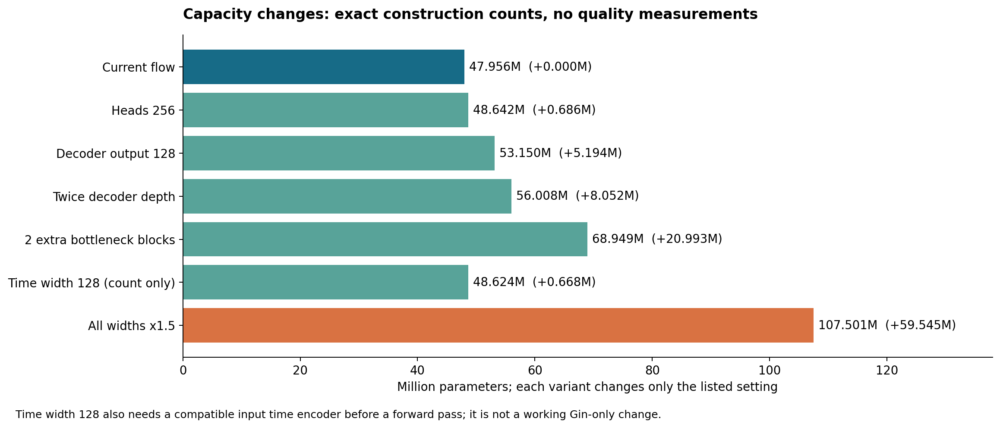

# Is this Point Transformer v3 sufficient for generation?

**My assessment: it is a plausible backbone for aligned Gaussian refinement, but the current pipeline does not implement diverse conditional generation or learned growth of the Gaussian set. Increasing its 47.96M parameters would not, by itself, supply either capability.** Whether capacity is limiting refinement quality remains an empirical question.

The [architecture audit](architecture_and_parameters.md) gives exact parameter counts and source provenance. Findings below distinguish observed implementation behavior from hypotheses to test. No model-quality experiments were run for this report.

## What “generation” means changes the answer

| Intended task | What the current implementation supports | Assessment |
|---|---|---|
| Improve an aligned source Gaussian scene | Predict all 23 attributes per existing Gaussian, conditioned on current state, time, and source-based neighborhoods | Architecturally plausible; count does not establish insufficiency |
| Sharpen rendered images without more Gaussians | Change position, size, opacity, orientation, and color | Possible; quality and representation limits require measurement |
| Increase Gaussian count inside the network | Output has the same N slots as the input | Not implemented; upstream densification is a separate operation |
| Produce multiple plausible reconstructions for the same input | Sampler clones the same source and applies deterministic Euler updates | No explicit diversity mechanism in the inspected sampler |
| Generate objects from a noise prior, text, or images | No corresponding prior sampler or text/image conditioning branch | Not implemented end to end; PTv3 could be adapted |

A fixed-N network can be a valid generative backbone if it transforms a sampled set of N latent/noise points into a sample. A U-Net can also parameterize a generative velocity field. Neither fixed cardinality nor an encoder–decoder design intrinsically disqualifies it. What matters is the probability path, conditioning, representation, training, and sampling. Flow Matching explicitly trains vector fields that can transport a noise distribution into data. [Flow Matching for Generative Modeling](https://arxiv.org/abs/2210.02747).

## Highest-priority findings from this code

### 1. The current sampler transports a supplied scene; it does not sample uncertainty

In [sr/flow.py, lines 74–112](../../sr/flow.py), training constructs:

```text
x(t) = (1 − t) x_source + t x_target + gamma(t) epsilon
v_target(t) = x_target − x_source + gamma_dot(t) epsilon
```

With the default `flow_noise_std=0.0`, the path is a straight interpolation between corresponding source and target attributes. [sample_flow_model, lines 240–278](../../sr/flow.py) starts from a clone of the supplied source and applies `x ← x + v/steps`. It switches to eval mode, uses no random latent, and adds no sampling noise. Its intended mathematical mapping is deterministic for a fixed source/model/step count, apart from possible numerical kernel nondeterminism.

Even increasing **training interpolant noise** does not add a conditional sampling seed to this sampler. For diverse outputs, define a random initial variable or an appropriate stochastic sampler and train a consistent conditional path. Randomizing the source at inference without matching training would introduce a distribution mismatch.

### 2. The default alignment preserves source Gaussian count

The `fit_lr_to_hr` launcher default routes through [sr/alignment.py](../../sr/alignment.py). [build_matching_source](../../sr/matching.py) preserves the input count, and matching fits a corresponding target on those source slots. The predictor and flow integrator continue to preserve that count. A higher target image resolution is therefore not evidence that more Gaussians are generated.

Other alignment modes have different setup: `emd`/`random` can densify upstream to a target count, while `fit_hr_to_lr` builds from a high-resolution set. These do not constitute learned point creation by PTv3. Evaluate whether preprocessing or alignment assumes target information that would be unavailable in the intended deployment. This is especially relevant to interpreting “generation” results; it is not a claim that the default LR-to-HR source reads target geometry.

For finer geometry, first establish the representation ceiling: directly optimize the same number of Gaussians against the same views, and compare with an externally densified set. If extra slots materially raise that ceiling, widening PTv3 alone cannot reproduce their extra representation capacity.

### 3. Spatial neighborhoods stay attached to the source

Both trainers and the sampler pass `batch_reference_means=source["means"]`. Inside [GSFlowPredictor, lines 161–171](../../models/feature_flow_predictor.py), those coordinates determine voxelization, serialization, and sparse-convolution support. Current predicted positions are still input features and may move; it is the neighborhood structure that stays source-based.

This is a reasonable inductive bias for correspondence-preserving refinement. For large deformation or completing previously unsupported regions, it may create a mismatch between learned interactions and current geometry. Test source-based versus current-state neighborhoods, keeping train and inference behavior consistent. Recomputing hard voxel assignments also introduces discontinuities and extra work, so it is not an automatic improvement. The source geometry is currently an implicit condition through neighborhoods, rather than a separately encoded continuous reference feature stream.

### 4. Time conditioning is unusually small, but time is not absent

The time path is `[t, sin(t), cos(t)] → 3 → 12 → 3`, followed by an independent `Linear(3,C)` in every block. All time-specific parameters total **17,239**, just **0.036%** of the model. At the additive injection, each block's time-dependent vector lies in an affine subspace of dimension at most three. Subsequent nonlinear layers can still produce much richer time-dependent behavior; this is not a three-dimensional bound on the complete output.

Because raw t is included, this embedding does not lose the identity of t over [0,1]. Its size is a plausible conditioning limitation, not a proof of failure. A richer Fourier/sinusoidal encoding with a 128–256-dimensional learned representation is a useful ablation. Adaptive LayerNorm is another option: DiT found the conditioning mechanism consequential in its own image-generation experiments. That result motivates an experiment here, not a guaranteed gain. [DiT project and conditioning results](https://www.wpeebles.com/DiT), [official implementation](https://raw.githubusercontent.com/facebookresearch/DiT/main/models.py).

**Changing Gin `T_dim` alone to 128 is not a working implementation:** `_time_embedding` still emits three channels. The input time encoder must be updated alongside the backbone. The count-only variant below retains additive injection; it is not an AdaLN parameter estimate.

### 5. Global and fine-detail capacity need separate diagnosis

About **77% of parameters sit in encoder levels 3 and 4**, while the final decoder is only 96 channels wide. This could be poorly allocated for a detail-heavy task, but no measured bottleneck follows from the counts. Skip connections preserve fine features; a 96-channel point feature is also larger than its 23-channel output.

At launcher grid resolution 2048, the coarsest nominal cells are only 1/256 of normalized coordinate units wide. A high point count can remain above the 1,024-token patch limit even there. Instrument point counts, patch counts, occupied convolution neighbors, and cross-patch connectivity. If broad scene interactions are missing, test a pooled global-token or cross-attention branch. If errors are primarily local details, test more decoder depth or width first.

The full 3³ CPE kernels consume **31.80M parameters**. If most kernel offsets rarely encounter occupied neighbors, some of that large weight budget receives little data. This is a hypothesis about utilization; it needs occupancy/gradient measurements. A separable CPE would sharply reduce the budget, but also changes the hypothesis class and may hurt accuracy. Reallocation should be a controlled experiment.

## Other limits that can look like insufficient model size

| Observation | Why it matters | Diagnostic |
|---|---|---|
| Position velocity uses `tanh` | Every velocity component is bounded by 1 in model units; over total integration time 1, each net position component is bounded by 1 | Measure fraction of target components exceeding 1 and fraction of predictions near saturation; noise can increase targets beyond the noiseless displacement range |
| SH degree is 1 | Color uses four SH basis coefficients per channel, regardless of network size | Compare the same-Gaussian oracle at SH1 versus higher SH degree for view-dependent errors |
| Attribute-space losses use matched slots | Gaussians are an unordered, non-unique rendering representation; poor correspondence can create conflicting targets | Compare alignment quality and rendered agreement before blaming capacity |
| Velocity loss is variance-normalized | Small estimated variance can amplify residuals; larger noise changes the target variance | Log raw and normalized error per attribute/channel, variance floors, and gradient contribution |
| Quaternion flow is additive by default | Linear interpolation between equivalent opposite-sign quaternions can approach zero and give undesirable targets | Audit quaternion sign alignment and rendered orientation; assess a consistent rotation representation/path |
| Heads start at zero | On the first backward pass, zero final weights block gradients to earlier layers; those layers receive learning signal after the final weights change | Treat first-step zero backbone gradients as expected; check persistence beyond initial steps |
| Head learning rates differ | Overfit config sets SH-rest LR to 1.5e-6 versus a 3e-4 backbone LR | Inspect head update sizes and convergence; slow SH-rest learning can resemble low capacity |
| `fm-only` disables render contribution | Nonzero render-loss weights alone do not activate rendering under this schedule | Compare attribute-space fit with rendered PSNR/SSIM/LPIPS using the actual selected schedule |
| Euler integration is approximate | Rollout errors may reflect numerical integration or off-path errors | Evaluate one checkpoint with 1, 5, 10, 20, and 50 steps before retraining |

The inspected trainers currently set **`EVAL_FLOW_STEPS = [10]`**. Their main evaluation sweeps therefore use 10 steps even when a launcher supplies a different `flow_matching.flow_steps`; some other sampling calls do use that configured value. Check saved evaluation labels and operative config before interpreting a purported one-step or five-step result.

## Measured cost of capacity changes



<!-- VARIANT_TABLE_START -->
| Construction | Parameters | Change |
|---|---:|---:|
| Current flow | 47,955,982 | +0 |
| Heads 256 | 48,642,446 | +686,464 |
| Decoder output 128 | 53,149,966 | +5,193,984 |
| Twice decoder depth | 56,008,334 | +8,052,352 |
| 2 extra bottleneck blocks | 68,949,006 | +20,993,024 |
| Time width 128 (count only) | 48,623,607 | +667,625 |
| All widths x1.5 | 107,500,830 | +59,544,848 |
<!-- VARIANT_TABLE_END -->

Each row was separately instantiated on CPU. These are parameter-cost comparisons, not quality or throughput results. Setting output_dim to 128 selects the entire decoder preset `(128,128,256,256)`, not just the final layer. The 1.5× width variant uses encoder `(96,144,192,384,768)` and decoder `(144,144,192,384)`, retaining the existing heads and block depths. “Twice decoder depth” means `(4,4,4,4)`; “2 extra bottleneck blocks” changes encoder depths to `(2,2,2,6,4)`.

Increasing all widths is expensive because the dominant terms are quadratic. Wider heads or richer additive time conditioning are much cheaper experiments. No parameter threshold distinguishes generative from non-generative networks: PTv3's original evidence concerns point-cloud perception, and its efficiency enables wider context rather than establishing generation quality. [PTv3 paper](https://arxiv.org/abs/2312.10035), [official repository](https://github.com/Pointcept/PointTransformerV3).

## Experiments that would resolve the capacity question

Run these in sequence and keep training data, alignment, seed sets, loss, and evaluation views controlled. Report both fixed-update and fixed-compute comparisons for architecture changes.

| Priority | Experiment | What the outcome would establish |
|---|---|---|
| 1 | Directly optimize the same Gaussian slots; separately optimize more slots or higher SH degree | Separates representation limits from network limits |
| 2 | Overfit 1 scene, then a small fixed multi-scene set; track attribute and render errors | Poor tiny-set fit narrows the issue to optimization, target consistency, or architecture; it does not by itself prove low capacity |
| 3 | Evaluate the same checkpoint over 1/5/10/20/50 integration steps, plus error across time bins | Separates solver/rollout limitations from interpolation training error |
| 4 | Improve time encoding and explicitly retain source features; test each independently | Tests conditioning limitations at small additional parameter cost |
| 5 | Measure stage occupancy/context; compare grids 384/1024/2048 and a global-context branch if justified | Tests neighborhood coverage and sparse-kernel utilization |
| 6 | Compare heads 128/256, wider decoder, deeper decoder, then 1.5× backbone widths | Tests where added capacity helps; avoid attributing a decoder gain to total size alone |
| 7 | If diversity is required, define and train a consistent latent/noise-conditioned path and sampler | Makes diverse generation testable; widening alone cannot supply a latent distribution |

Record held-out scene performance, same-input sample diversity when applicable, runtime, peak memory, and three training seeds where practical. A capacity explanation becomes persuasive if optimization is working and matched controls show both training and held-out improvement with scale. Low training error but poor held-out quality points more toward generalization, data, or conditioning. Better direct per-scene optimization but poor network fit establishes a learning gap, not which component causes it.

Point-cloud flow-matching research also shows that noise–data coupling and sampling behavior can materially affect generation quality at the same architecture. This supports checking the formulation before committing to a much larger network. [Not-So-Optimal Transport Flows for 3D Point Cloud Generation](https://research.nvidia.com/labs/genair/not-so-ot-flow/index.html).

**Recommended next decision:** keep the 47.96M backbone as the baseline, establish the fixed-representation oracle, and test time conditioning and decoder capacity. If the objective is diverse or count-increasing generation, specify and implement that capability in the formulation before treating more backbone parameters as the solution.
